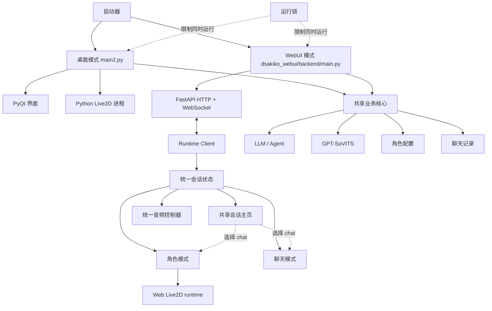
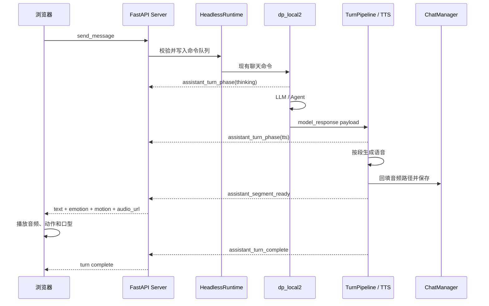

# D_sakiko WebUI 设计方案

> 状态：持续讨论中，Phase 0 技术验证进行中
>
> 创建日期：2026-07-13
>
> 最近更新：2026-07-24
>
> 适用范围：D_sakiko 主程序的独立 WebUI 模式与手机端 MVP

## 1. 背景

D_sakiko 当前是以 PyQt、Python Live2D runtime、LLM/Agent 和 GPT-SoVITS 为核心的桌面数字角色软件。用户希望在手机上使用角色聊天能力，但完整的 LLM、GPT-SoVITS 和模型资源不适合搬到手机端运行。

本方案采用“电脑运行后端，手机浏览器负责交互和演出”的形式。电脑继续承担角色配置、聊天上下文、LLM、Agent、TTS 和数据持久化；手机浏览器只负责输入、文本展示、音频播放和 Live2D 渲染。前端只以手机竖屏为正式产品形态，电脑浏览器仅用于开发调试，不承担桌面端适配目标。

WebUI 不是桌面程序启动后附带开启的远程窗口，而是一种可以独立启动的运行模式。用户在一次运行中选择桌面模式或 WebUI 模式，两种模式不会同时加载 GPT-SoVITS。

## 2. 已确定的核心决策

1. 在项目根目录新增 `dsakiko_webui/`，与 `GPT_SoVITS/` 同属一个代码仓库和安装包。
2. 桌面模式与 WebUI 模式是两个独立入口，正常情况下互斥运行。
3. WebUI 模式不启动 PyQt，不创建 pygame/OpenGL Live2D 窗口。
4. LLM、Agent、GPT-SoVITS、角色配置和聊天记录继续在电脑端运行和保存。
5. WebUI 尽可能复用 `character.py`、`dp_local2.py`、`audio_generator.py` 和 `chat/` 等现有业务模块。
6. WebUI 不直接复用或导入 `main2.py`，因为其中混合了 Qt 初始化、本地 Live2D 进程和桌面播放状态。
7. 不为 WebUI 大规模重构 `main2.py`。第一版允许 Web 后端保留独立编排代码；只有边界清晰、验证充分且确实需要复用的纯业务逻辑，才逐步抽成小型共享模块。
8. 浏览器端根据服务端推送的高层 JSON 事件执行动作，不接触 Python 内部队列协议。
9. 浏览器 Live2D 使用 Web runtime 重新实现渲染，但复用现有模型资源、项目标准动作组和 emotion 语义。当前 WebUI MVP 只覆盖项目现有的 Cubism 2/V2 模型，V3 兼容留到 MVP 之后评估。
10. MVP 聚焦单角色语音聊天和 Live2D 演出，不包含小剧场，也不追求与桌面端立即功能对齐。
11. WebUI 与桌面程序共享版本号、更新系统、角色资源和聊天记录，不再分发一份 GPT-SoVITS 依赖。
12. 手机端以共享的 `ChatListView` 作为会话主页；列表项代表稳定的 `chat_id`，不是单独的角色。一个角色可以拥有多条互不混合的会话。
13. 当前会话内部提供“角色模式”和“聊天模式”两种 UI；两种模式共享 `current_chat_id`、消息状态、WebSocket 连接和音频控制器，只更换表现层。
14. 角色模式负责 Live2D 演出、自动语音播放和 Galgame 风格文本展示；聊天模式采用类似 LINE/微信的消息气泡，角色语音由用户点击消息后播放。
15. 角色模式和聊天模式复用同一个会话主页与 `switch_chat(chat_id)` 动作：从聊天模式选择后进入消息界面，从角色模式选择后返回角色界面。
16. UI 模式属于浏览器本地偏好，不改变服务端推理流程，也不创建两份聊天记录。
17. 用户输入草稿按 `chat_id` 隔离保存，切换 UI 时继续使用当前会话草稿，切换 chat 时不能把草稿带入另一条会话。
18. 回复生成期间允许打开会话主页查看其他 chat，但禁止切换；前端禁用其他会话项，后端仍必须拒绝并发的 `switch_chat` 命令。
19. 前端与后端采用契约优先、可独立推进的方式开发。前端同时提供 Mock Runtime 和真实 WebSocket Runtime，后端为零时也能完成主要交互与状态开发。
20. 当前前端正式验收范围为 Android Chrome 手机竖屏，不为 PC 设计另一套响应式布局；iOS Safari 延后评估。

## 3. 产品目标

### 3.1 目标

- 用户可以不启动桌面 Qt 界面，单独启动 WebUI Server。
- 手机与电脑处于同一局域网时，可以通过浏览器连接 D_sakiko。
- 手机可以发送消息，电脑完成 LLM 推理和 GPT-SoVITS 合成。
- 手机显示回复文本，播放角色语音，并驱动 Live2D 动作和口型。
- 用户可以在类似 LINE/微信的最近会话主页中查看已有 chat，选择一条后恢复其角色、消息和 Live2D 状态。
- 用户可以在角色模式和聊天模式中打开同一个会话主页，并在切换 UI 后继续使用同一个 `current_chat_id`。
- 同一角色的多条 chat 保持独立上下文、独立消息历史和独立输入草稿。
- 前端可以在没有真实后端的情况下通过 Mock Runtime 独立运行和演示。
- WebUI 产生的消息写入现有聊天记录，之后可以继续在桌面模式中查看。
- WebUI Server 与桌面程序不会同时加载两份语音模型。
- 新增 WebUI 文件可以通过现有差分更新系统推送给已有用户。

### 3.2 MVP 非目标

- 不支持桌面 Qt 与 WebUI Server 同时运行和同步展示。
- 不支持通过公网直接暴露服务。
- 不支持多个用户或多个手机客户端同时控制角色。
- 不追求第一版支持全部 Agent 工具。
- 不支持小剧场模式。
- 不支持角色模型下载器、动作编辑器和完整设置中心。
- 不在手机端运行 LLM、TTS 或 Python Live2D runtime。
- 当前阶段不验收 iOS Safari。
- 不在第一版实现 PWA 后台通知、离线模式和云端账号体系。
- 不以 PC 浏览器为正式产品形态，不提供桌面宽屏专用布局。
- 不在第一版复制微信或 LINE 的群聊、朋友圈、已读回执、撤回、表情商店等完整社交功能。
- 不在第一版实现会话重命名、删除、复制、分叉、拖拽排序和导入导出等完整管理能力；MVP 只提供列表、切换与简单新建。

## 4. 总体架构



### 4.1 两种运行模式

桌面模式：

```text
main2.py
  -> PyQt
  -> dp_local2
  -> audio_generator
  -> Python Live2D 进程
```

WebUI 模式：

```text
dsakiko_webui/backend/main.py
  -> FastAPI
  -> HeadlessRuntime
  -> dp_local2
  -> audio_generator
  -> WebSocket
  -> 浏览器 Live2D
```

两种模式共享数据和业务模块，但不共享 UI 进程。WebUI Server 启动时不应导入 PyQt、pygame Live2D 窗口代码或 `main2.py`。

## 5. 建议的代码结构

```text
D_sakiko/
├── GPT_SoVITS/
│   ├── runtime/
│   │   ├── runtime_lock.py
│   │   └── app_paths.py
│   ├── character.py
│   ├── dp_local2.py
│   ├── audio_generator.py
│   ├── main2.py
│   └── chat/
├── dsakiko_webui/
│   ├── backend/
│   │   ├── main.py
│   │   ├── runtime.py
│   │   ├── turn_pipeline.py
│   │   ├── protocol.py
│   │   ├── websocket_manager.py
│   │   ├── media_routes.py
│   │   ├── live2d_routes.py
│   │   └── security.py
│   ├── frontend/
│   │   ├── src/
│   │   │   ├── runtime/
│   │   │   ├── state/
│   │   │   ├── audio/
│   │   │   ├── live2d/
│   │   │   ├── views/
│   │   │   └── components/
│   │   └── package.json
│   ├── static/
│   └── README.md
├── run_webui.bat
└── run_webui.command
```

以上是目标结构，不要求第一阶段一次性创建全部文件。

### 5.1 共享运行时模块

#### `runtime_lock.py`

- 提供跨平台运行锁。
- 桌面模式和 WebUI 模式竞争同一把锁。
- 防止同时加载两份 GPT-SoVITS。
- 防止两个进程同时写入聊天记录。
- 锁中记录 PID、模式、启动时间和版本，方便显示明确的冲突提示。

#### `app_paths.py`

- 统一解析项目根目录、`reference_audio/`、`live2d_related/` 和配置文件路径。
- 避免新入口依赖 `os.chdir()` 和 `../reference_audio`。
- 对外输出规范化绝对路径，对存储继续保持当前兼容格式。

### 5.2 WebUI Backend 模块

#### `backend/runtime.py`

`HeadlessRuntime` 是 WebUI 模式的组合入口，负责：

- 初始化角色列表和 `ChatManager`。
- 读取普通 chat 摘要、维护 `current_chat_id`，并顺序处理新建与切换命令。
- 初始化 `DSLocalAndVoiceGen`。
- 初始化 `AudioGenerate`。
- 创建命令队列、回复队列和状态队列。
- 启动 LLM 与 TTS 工作线程。
- 将领域事件交给 WebSocket 管理器。
- 关闭时保存聊天记录并回收模型 Worker。

#### `backend/turn_pipeline.py`

第一版先作为 WebUI 后端自己的单轮回复编排，不要求桌面主程序立即改用它：

- 接收 `dp_local2` 产生的结构化模型回复。
- 校验角色、turn、segment 和 emotion。
- 按段调用 `AudioGenerate`。
- 处理取消、重试和错误状态。
- 回填消息的音频路径和翻译。
- 发布“阶段变化、段落就绪、轮次完成”等领域事件。

它不负责：

- 等待本地 Live2D 动作完成。
- 操作 Qt 控件。
- 直接操作 WebSocket。
- 决定浏览器什么时候播放音频。

等 WebUI 流程稳定且与桌面逻辑的共同边界足够清楚后，再评估是否将其中的纯业务部分上移到 `GPT_SoVITS/runtime/`。不能为了形式上的复用先大改 `main2.py`。

#### `backend/protocol.py`

- 定义命令和事件的数据模型。
- 定义 `protocol_version`。
- 负责字段校验和向后兼容。
- 禁止把 Python 对象、内部队列标记和本地文件绝对路径直接发给浏览器。

#### `backend/media_routes.py`

- 把生成音频转换为受控 URL。
- 只允许访问授权目录中的文件。
- 校验路径，阻止 `../` 路径穿越。
- 可使用短期 media id，避免暴露真实本地路径。

#### `backend/live2d_routes.py`

- 提供当前角色和模型信息。
- 提供浏览器加载模型所需的同源静态文件。
- 限制访问范围为已登记的 Live2D 模型目录。
- 将项目模型路径转换为浏览器 URL。

#### `backend/security.py`

- 生成配对码和短期访问 Token。
- 验证 WebSocket 与 HTTP 请求。
- 限制 Origin，不启用任意来源 CORS。
- 限制上传大小、消息长度和请求频率。

### 5.3 WebUI Frontend 模块

前端应按“运行时与表现层分离”的方式组织：

```text
frontend/src/
├── runtime/
│   ├── runtime_client.js
│   ├── mock_runtime_client.js
│   └── websocket_runtime_client.js
├── state/
│   ├── runtime_context.jsx
│   └── conversation_reducer.js
├── audio/
│   └── audio_controller.js
├── live2d/
│   └── live2d_stage.jsx
├── views/
│   ├── chat_list_view.jsx
│   ├── character_view.jsx
│   └── chat_view.jsx
└── components/
    ├── chat_list_item.jsx
    ├── mode_switcher.jsx
    ├── message_composer.jsx
    ├── message_bubble.jsx
    └── typing_status.jsx
```

- `RuntimeClient` 定义前端需要的稳定命令和事件接口。
- `MockRuntimeClient` 在没有 Python 后端时模拟完整对话、失败、取消和断线。
- `WebSocketRuntimeClient` 只负责协议收发、重连和事件反序列化。
- `conversation_reducer` 是会话主页和两种 UI 的唯一会话状态来源，保存会话摘要列表、`current_chat_id`、当前消息与轮次状态。
- 草稿使用 `drafts_by_chat_id` 保存；会话切换只改变当前指针，不移动或复制其他 chat 的草稿。
- `audio_controller` 保证同一时间只播放一组角色语音，并向 Live2D 提供音量数据。
- `chat_list_view`、`character_view` 和 `chat_view` 不直接访问 WebSocket，也不各自保存一份消息列表。

### 5.4 开发分工与协作边界

前端可以先于后端独立完成，双方只通过协议文档和模拟事件协作。

前端负责：

- 共享会话主页、两种手机 UI、页面返回关系、模式切换、消息状态和输入交互。
- Live2D 模型加载、动作、音频播放与口型同步。
- Mock Runtime、WebSocket Client 和断线重连表现。
- 手机软键盘、安全区、滚动和触摸交互适配。

后端负责：

- FastAPI 生命周期、HTTP/WebSocket 接口和运行锁。
- 角色、聊天记录、LLM/Agent 和 GPT-SoVITS 的初始化与调用。
- 将本地音频和 Live2D 资源转换为受控 URL。
- 按协议发布状态、消息、分段、完成、取消和错误事件。

需要共同确认的只有协议字段、事件时序和联调中发现的语义偏差。前端不要求后端按照 React 的组件结构实现，后端也不要求前端理解 Python 内部队列。

## 6. Headless Runtime 与现有队列的关系

第一版可以继续利用 `dp_local2.text_generator()` 当前使用的队列接口，但在 WebUI 模式中赋予它们新的适配含义：

| 现有接口 | WebUI 模式中的含义 |
|---|---|
| `qt2dp_queue` | 浏览器命令进入 LLM 线程的命令队列 |
| `dp2qt_queue` | LLM/Agent 产生的 UI 领域事件队列 |
| `QT_message_queue` | 加载、错误、工具状态等运行状态队列 |
| `text_queue` | 结构化模型回复进入 TTS 流水线的队列 |
| `change_char_queue` | 角色或 Live2D 模型变化事件队列 |
| `is_text_generating_queue` | 当前轮次是否处于思考阶段的状态信号 |
| `is_audio_play_complete` | 服务端生成流程的完成信号，不代表手机已播放完毕 |

WebUI 不应直接把这些队列中的原始值转发给浏览器。Server 必须将它们转换成稳定的领域事件。

## 7. 单轮消息执行链



### 7.1 播放完成语义

WebUI Server 不等待浏览器报告音频播放完成：

- `assistant_segment_ready` 表示文本和音频已经可以消费。
- `assistant_turn_complete` 表示服务端生成任务完成，而不是手机播放完成。
- 浏览器负责维护音频和动作播放队列。
- 手机断网、锁屏或关闭页面不能阻塞服务端工作线程。
- 后续如需统计播放状态，可以增加非阻塞 ACK，但 ACK 不参与核心推理流程。

## 8. WebSocket 协议草案

### 8.1 通用事件信封

```json
{
  "protocol_version": 1,
  "type": "assistant_segment_ready",
  "event_id": "evt_xxx",
  "timestamp": 1783900000,
  "chat_id": "chat_xxx",
  "turn_id": "turn_xxx",
  "data": {}
}
```

### 8.2 MVP 客户端命令

- `get_state`：请求当前状态快照。
- `get_chat_list`：请求普通 chat 的轻量摘要列表，不返回所有完整消息。
- `send_message`：向指定 `chat_id` 发送消息；该 id 必须与服务端当前会话一致。
- `cancel_turn`：取消当前生成。
- `next_background`：按稳定顺序切换到下一张角色模式背景。
- `switch_chat`：按稳定 `chat_id` 切换现有普通聊天；成功后返回新的 `state_snapshot`。
- `create_chat`：选择角色并创建一条普通 chat，可附带名称和用户人设；创建成功后将其设为当前会话。

客户端发送消息时必须生成稳定的 `client_message_id`。网络重试只能重复使用同一个 id，后端不得因此重复创建用户消息。

`switch_chat` 不是单纯修改前端指针。前端发送命令后必须等待服务端确认的新 `state_snapshot`，才能提交 `current_chat_id` 和进入目标界面。生成期间服务端以结构化 `CHAT_BUSY` 错误拒绝切换，不能静默切换或把后续事件写入另一条 chat。

### 8.3 MVP 服务端事件

- `runtime_ready`：服务端和模型初始化完成。
- `chat_list_snapshot`：所有普通 chat 的轻量摘要、最近活跃时间和 `current_chat_id`。
- `state_snapshot`：当前角色、当前 chat 的消息、当前轮次、模型资源、当前背景和可用背景列表。
- `user_message_ack`：确认用户消息已被后端接受，返回服务端消息 id。
- `assistant_turn_phase`：`thinking`、`tts`、`idle` 等阶段变化。
- `assistant_segment_ready`：一个文本与音频段落可以播放。
- `assistant_turn_complete`：一轮生成成功、取消或失败。
- `live2d_command`：切换模型、动作或角色状态。
- `runtime_status`：模型加载和服务状态提示。
- `error`：可展示给用户的结构化错误。

### 8.4 段落事件示例

```json
{
  "protocol_version": 1,
  "type": "assistant_segment_ready",
  "event_id": "evt_001",
  "timestamp": 1783900000,
  "chat_id": "chat_001",
  "turn_id": "turn_001",
  "data": {
    "sequence": 0,
    "message_index": 12,
    "character_name": "有咲",
    "text": "你先别急，我来解释。",
    "translation": "",
    "emotion": "anger",
    "motion_group": "anger",
    "audio_url": "/api/media/audio_001",
    "duration_ms": 3200
  }
}
```

### 8.5 MVP HTTP 与 WebSocket 边界

| 接口 | 用途 |
|---|---|
| `GET /api/health` | 判断 Server 是否启动，不触发模型推理 |
| `GET /api/state` | 获取首次加载所需的状态快照 |
| `GET /api/chats` | 获取普通 chat 的轻量摘要列表 |
| `WS /api/ws` | 发送客户端命令并接收服务端事件 |
| `GET /api/media/{media_id}` | 获取受控的生成音频 |
| `GET /api/live2d/{path}` | 获取已登记模型目录中的资源 |

- 前端不拼接本地路径，只使用状态或事件中返回的 URL。
- 正式发布时前端静态文件与 API 应尽量同源提供。
- 开发环境可以由 Vite 代理 API，但不能把 Vite 的 `/@fs/` 路径带入生产协议。
- `/api/state` 与 `state_snapshot` 表达同一种状态模型，避免 HTTP 和 WebSocket 各维护一套字段。

### 8.6 前端 Runtime Client 与 Mock

前端统一依赖以下抽象能力：

```text
connect(on_event)
get_state()
get_chat_list()
send_message(chat_id, text, client_message_id)
cancel_turn(turn_id)
switch_chat(chat_id)
create_chat(character_name, name, user_persona_id)
next_background()
disconnect()
```

实现分为：

- `MockRuntimeClient`：使用固定角色、模型、文本和测试音频，按定时器产生协议事件。
- `WebSocketRuntimeClient`：连接真实 FastAPI，处理鉴权、命令发送、重连和状态恢复。

Mock 至少能够演示：

- 单段和多段角色回复。
- `thinking -> tts -> complete` 正常流程。
- 用户取消、LLM 失败、TTS 失败和断线重连。
- 生成期间切换两种 UI。
- 同一角色多条 chat 的最近会话列表、新建和切换。
- 角色模式与聊天模式打开同一个 `ChatListView`，选择后分别返回原模式。
- 不同 chat 的输入草稿隔离，以及生成期间“列表可查看、其他 chat 不可切换”。
- 背景顺序切换和背景加载失败回退。
- 页面刷新后重新获取状态快照。

Mock 事件必须复用正式协议数据结构，不能为演示另造一套前端专用格式。这样前端可以先独立完成约 85%～90%，真实后端完成后只替换 Runtime Client。

## 9. 移动端会话主页、双 UI 与 Live2D 设计

### 9.1 手机端基线

- 当前正式目标平台为 Android Chrome；iOS Safari 兼容性不属于 Phase 0/1A 验收范围。
- 正式设计范围为手机竖屏，重点覆盖 `360px～430px` CSS 宽度。
- 不追求不同手机像素级完全一致，而是保证信息层级、触摸体验和角色主体在各尺寸下稳定。
- Live2D 舞台、背景和页面结构使用容器百分比、Grid/Flex、`minmax()` 与 `aspect-ratio`；按钮、输入框、面板和间距使用带上下限的固定尺寸、`rem`、`min()`、`max()` 或 `clamp()`。
- 字体使用稳定的 `rem` 或 `px`，不随视口宽度缩放。可点击控件的有效触摸区域不小于 `44px`，不能为了适应小屏整体缩小所有控件。
- 页面使用 `100dvh` 和 `safe-area-inset-*`，避免被地址栏、刘海和底部手势区遮挡。
- UI 覆盖层必须监听 `visualViewport.resize` 和 `visualViewport.scroll`，使用其 `height` 与 `offsetTop` 表示软键盘出现后真正可见的区域；不只依赖 `100dvh` 或普通的 `position: fixed`。
- 输入框固定在可视区域底部，而不是物理屏幕底部。软键盘弹出后，它随可视区域底边移动到键盘上沿，用户始终能看见正在输入的内容。
- 输入框从一行自动增长，最多显示约 3～4 行；超过后输入框内部滚动，不能无限挤压回复区域。
- 回复区域位于输入框上方，并根据剩余可见高度限制最大高度。聊天列表应增加与输入框实时高度一致的底部留白。
- 软键盘弹出时只重新排列 UI 覆盖层，可以收起非必要顶栏；Live2D Canvas 保持原始布局尺寸并被键盘遮住一部分，不随键盘开合反复缩放或跳动。
- 不支持 `visualViewport` 的浏览器使用 `window.innerHeight` 降级，并仍需保证输入框不被完全遮挡。
- PC 浏览器只显示可调试的手机布局，不单独设计宽屏导航、侧栏或鼠标交互。
- 横屏不作为 MVP 主场景，只要求内容可恢复、无重叠且能返回竖屏继续使用。

### 9.2 共享状态与表现层

会话主页与两种 UI 共享：

- 普通 chat 的轻量摘要列表、当前角色、`current_chat_id` 和当前消息列表。
- 当前 `turn_id`、它所属的 `chat_id`、生成阶段和取消状态。
- 唯一 WebSocket 连接与重连逻辑。
- 唯一音频控制器、播放队列和音量分析器。
- 按 `chat_id` 保存的 `drafts_by_chat_id`；切换 UI 后继续编辑当前草稿，切换 chat 后读取目标 chat 自己的草稿。
- 当前页面 `active_view`、打开会话主页前的 `chat_list_return_view`，以及首次选择时使用的 `preferred_session_view`。
- 文本显示偏好 `original/translation`，切换 UI 后保持一致。
- 当前背景 id 和后台返回的可用背景列表。

UI 模式只决定事件如何展示和何时播放音频，不影响后端是否生成回复。模式切换不发送给后端，也不取消正在进行的轮次。

文本显示切换属于两种 UI 共用的表现层能力：

- 顶栏提供“原文 / 译文”分段控制，不硬编码为“日文 / 中文”，为以后其他原文语言保留兼容性。
- 角色模式切换当前回复框中的 `text` 与 `translation`；聊天模式切换所有角色消息的显示内容。
- 显示偏好只保存在浏览器本地，不发送新的 LLM 请求，不重新合成或重新播放语音。
- 音频始终对应原文。切换显示文字不能中断当前音频、动作或口型，也不能重新开始打字机动画。
- 消息没有 `translation` 时自动回退到 `text`；当前会话完全没有译文时，可以隐藏或禁用“译文”选项。

### 9.3 会话主页与页面层级

`ChatListView` 是角色模式和聊天模式共同使用的应用级会话主页，不属于某一种表现模式，也不是单纯的角色选择器。页面层级为：

```text
ChatListView
├── 从聊天模式进入 -> 选择 chat -> ChatView
└── 从角色模式进入 -> 选择 chat -> CharacterView
```

- 聊天模式以会话列表作为主界面；从 `ChatView` 返回时进入 `ChatListView`。
- 角色模式顶栏提供会话图标；点击后打开同一个全屏 `ChatListView`，选择后返回 `CharacterView`。
- 两个入口复用同一个列表组件、摘要数据和 `switch_chat(chat_id)`，区别只在选择成功后返回哪个 View。
- `ChatView` 与 `CharacterView` 之间切换时继续使用当前 chat，不必先返回会话主页。
- 选择当前 chat 不向后端重复发送切换命令，只关闭会话主页并返回来源 View。
- 页面首次启动或完整刷新时进入 `ChatListView` 并恢复上次 `current_chat_id`；选择后进入浏览器保存的 `preferred_session_view`，没有偏好时默认进入 `ChatView`。
- 记录缺失时由 HeadlessRuntime 使用现有 `ChatManager` 规则保证至少存在一条普通 chat。

会话主页采用类似 LINE/微信的扁平最近会话列表，不在 MVP 中照搬桌面端的角色折叠分组：

- 每一项代表一条稳定的 `chat_id`，展示角色头像、`chat.name`、角色名、最后一条消息摘要、最近活跃时间和当前运行状态。
- 同一角色的多条 chat 分别展示，例如日常闲聊和概念学习不能合并为一个“联系人”。
- 列表只加载摘要；选择后再加载目标 chat 的消息和状态，不能为了显示主页一次发送所有会话的完整历史。
- 会话主页提供简单的新建入口，允许选择角色、填写可选名称和用户人设；重命名、删除、复制、分叉、拖拽排序和导入导出留到 Phase 6。
- 空列表、角色缺失、摘要加载失败和目标 chat 已不存在时，都必须提供明确的恢复状态，不能进入空白页面。

### 9.4 会话切换规则

系统可以保存多条普通 chat，但任意时刻只有一个由 HeadlessRuntime 持有的 `current_chat_id`。切换必须遵循：

1. 前端发送 `switch_chat(chat_id)` 后保持现有 `current_chat_id`，并显示切换中状态。
2. HeadlessRuntime 校验目标 chat、绑定角色和当前轮次状态。
3. 前端收到成功的 `state_snapshot` 后，停止旧 chat 的音频、清空待播放 segment 和口型状态，再一次性提交新的角色、消息、Live2D 模型和 `current_chat_id`。
4. 选择完成后，根据打开会话主页时的来源进入 `ChatView` 或 `CharacterView`。

回复生成期间：

- 用户仍可打开会话主页查看摘要，当前生成 chat 显示明确的运行状态。
- 除当前 chat 外，其他会话项禁用并说明“当前回复完成后可切换”。
- 后端必须再次校验并以 `CHAT_BUSY` 拒绝切换，不能只依赖前端禁用状态。
- 新建 chat 也会改变 `current_chat_id`，因此生成期间同样禁用，并由后端以 `CHAT_BUSY` 拒绝。
- MVP 不自动取消当前回复，也不排队等待切换；“取消当前回复并切换”可以在后续版本单独设计。

切换 chat 不触发 LLM 或 TTS，不复制消息，不改变其他 chat 的草稿。切换成功后必须按目标 chat 同步角色、chat 自定义 Live2D 模型、消息、主题与语音状态，不能只替换头像和角色名。

### 9.5 角色模式

角色模式强调即时演出和陪伴感：

- Live2D 占据主要画面，顶部显示角色身份、连接状态、会话入口和模式切换。
- 底部使用 Galgame 风格回复区域，包含角色名、角色文本和必要的播放状态。
- 回复区域在视觉上参考 `GPT_SoVITS/multi_char_live2d_module.py` 中的 `TextOverlay`：保留角色名标签、半透明正文框、轻边框、清晰留白和打字机效果。
- Web 端只参考 `TextOverlay` 的视觉语言，不复用其 Pygame/OpenGL 绘制代码，也不照搬其中按窗口比例计算字体和控件尺寸的方式。
- 用户输入框位于回复区域下方，并固定在 `visualViewport` 的可见底部；键盘弹出时回复区域移动到输入框上方，Live2D Canvas 不缩放。
- `thinking` 阶段播放思考动作；每个 `assistant_segment_ready` 到达后可立即显示文本、自动播放语音并驱动 emotion 动作和口型。
- 点击回复区域可以立即展开本段完整文字，但不默认跳过或终止音频。
- 提供轻量历史入口，允许查看当前会话消息，但不在角色画面中常驻完整聊天列表。

移动浏览器通常要求一次用户手势才能启用声音。角色模式首次进入时需要明确的音频解锁交互；解锁后才允许自动播放后续角色语音。

角色模式复用主程序 `live2d_related/` 根目录中的 `.png` 和 `.jpg` 背景：

- Server 只枚举根目录中登记过的背景文件，不能递归把角色模型纹理当作背景。
- 背景列表使用稳定排序，并通过受控 id 和 URL 发给浏览器，不暴露电脑绝对路径。
- 背景使用 `cover` 填充手机竖屏，允许必要裁剪，但不能拉伸变形。
- 顶栏提供背景切换图标按钮；点击后发送 `next_background`，由 HeadlessRuntime 更新当前背景并发布状态。
- 当前背景沿用主程序的背景配置进行持久化，页面刷新或以后回到桌面模式时保持选择。
- 背景加载失败时保留当前背景或回退为纯色，不影响 Live2D、对话和音频。

### 9.6 聊天模式

聊天模式强调随手发送、历史阅读和手动播放：

- 顶栏显示返回会话主页按钮、角色头像、角色名、连接状态和模式切换。
- 用户消息位于右侧，角色消息位于左侧。
- 用户点击发送后立即出现本地消息；收到 `user_message_ack` 后标记为已接受，失败时提供重试。
- 从 `thinking` 开始到本轮完成前，顶栏显示“对方正在输入…”。
- 角色消息在文字与所需音频均准备完成后进入列表，不展示尚未完成的半条消息。
- 点击角色消息播放语音，再次点击暂停或继续；点击另一条消息时切换播放对象。
- 正在播放的消息显示明确的播放状态和进度，尚未播放的语音可以显示未播放标记。
- MVP 支持复制角色文本，不实现已读回执、撤回、复杂长按菜单和社交功能。

聊天模式默认不自动播放角色语音，避免打扰用户并规避移动浏览器自动播放限制。

- 聊天模式 MVP 使用安静的纯色背景和少量角色主题色，不复用角色模式的图片背景，优先保证消息可读性。

### 9.7 多段回复在两种 UI 中的表现

后端继续按 segment 推送，不需要感知当前 UI：

- 角色模式按 `sequence` 消费已就绪 segment，可以边合成边演出。
- 聊天模式按 `sequence` 将每个 segment 显示为独立角色气泡，同一轮的连续气泡共享 `turn_id`，但不合并文本。
- 每个角色气泡只持有本 segment 对应的音频 URL；点击后由统一音频控制器播放该段语音。
- 气泡顺序必须严格遵循 segment 的 `sequence`，不能按音频完成先后乱序插入。
- 任一 segment 失败时，完成事件必须给出整轮状态，由前端决定展示可重试错误还是已完成的部分内容。

建议的前端轮次结构：

```json
{
  "turn_id": "turn_001",
  "role": "assistant",
  "status": "ready",
  "segments": [
    {
      "sequence": 0,
      "text": "你先别急。",
      "translation": "先别着急。",
      "emotion": "anger",
      "audio_url": "/api/media/audio_001",
      "duration_ms": 1800
    }
  ]
}
```

### 9.8 模式切换

- 顶栏提供“角色 / 消息”分段控制，模式偏好保存在浏览器本地。
- 切换时保留消息、当前 chat 的草稿、生成进度和 `current_chat_id`，不重新请求 LLM。
- 音频控制器位于两个 View 之外，避免切换时产生两个播放器。
- Live2D Canvas 只能存在一个实例；隐藏、暂停或销毁策略需要根据实机内存和恢复速度测试后确定。
- 断线、失败和取消状态必须在两种模式中表达一致，不能只在其中一个界面可见。

### 9.9 浏览器 Live2D

浏览器端不能复用 Python 的 pygame/OpenGL 渲染实现，需要使用成熟的 Web Live2D runtime。当前 PoC 使用 `pixi-live2d-display/cubism2` 加载项目现有的 Cubism 2/V2 模型；Phase 0 继续验证许可证和真实 V2 资源兼容性，V3 不属于 MVP 范围。

#### 9.9.1 需要支持的演出状态

| 服务端状态 | 浏览器行为 |
|---|---|
| `runtime_ready` | 加载当前角色并进入待机 |
| `thinking` | 循环播放 `text_generating` |
| `assistant_segment_ready` | 根据 emotion 选择动作组 |
| 音频开始 | 播放说话动作并启动口型同步 |
| 音频结束 | 结束说话动作并恢复待机 |
| `cancel_turn` | 停止当前音频和动作，恢复待机 |
| `live2d_command` | 切换角色、模型或背景 |

#### 9.9.2 动作语义

- 继续使用项目标准动作组，例如 `IDLE`、`idle_motion`、`text_generating` 和 emotion 动作组。
- 浏览器端必须为缺失动作组提供回退，不因模型资源不完整导致整个页面失效。
- emotion 到动作组的映射只保留一份稳定定义，避免桌面和 Web 各自发明标签。
- 模型切换事件传递模型身份或 URL，不传递电脑绝对路径。

#### 9.9.3 口型同步

- 口型由浏览器根据正在播放的音频本地计算。
- 使用 Web Audio API 分析音量或频谱并驱动嘴部参数。
- 服务端不逐帧推送嘴型值，避免网络延迟和大量消息。
- 音频开始、暂停、结束时应正确复位嘴部参数。

## 10. 聊天记录与数据一致性

### 10.1 单写入者原则

- 桌面模式和 WebUI 模式通过运行锁互斥。
- WebUI 模式下只有 `HeadlessRuntime` 可以修改 `ChatManager`。
- FastAPI 请求处理线程不能直接写 `all_conversation.json`。
- HTTP/WebSocket 命令先进入 Runtime 命令队列，由现有聊天线程顺序处理。

### 10.2 会话摘要与最近活跃时间

- 为 `ChatMeta` 增加可选的 `last_active_at`，使用 UTC Unix 时间戳；旧存档缺失该字段时必须继续正常加载。
- 新建 chat，以及用户或角色消息成功写入、编辑或删除后更新 `last_active_at`；仅查看或切换 chat 不更新时间。
- 时间更新由 Chat/ChatManager 的统一方法完成，不能分散在 Qt 和 WebUI 各自维护。
- WebUI 按 `last_active_at` 倒序展示最近会话；缺失时间的旧 chat 按 `ChatManager` 中原有保存顺序稳定兜底。
- 不能用 `all_conversation.json` 的文件修改时间或音频文件时间猜测单条 chat 的活跃时间。
- WebUI 的最近排序只影响客户端展示，不重写桌面端已有的手动 chat 顺序。
- `chat_list_snapshot` 只包含 `chat_id`、名称、角色、头像或主题资源、最后消息摘要、`last_active_at` 和运行状态，不包含完整 `message_list`。
- 消息或 chat 变更成功持久化后，由 HeadlessRuntime 发布新的摘要；前端不能仅凭乐观消息自行猜测最终 `last_active_at` 和排序。

### 10.3 状态快照

- 浏览器首次连接、断线重连和 chat 切换成功时请求或接收 `state_snapshot`。
- 快照至少包含当前角色、`current_chat_id`、当前 chat 的消息、当前轮次、模型资源、当前背景和可用背景列表。
- 当前轮次必须携带所属 `chat_id`；客户端忽略与当前快照不匹配的迟到事件。
- `chat_list_snapshot` 与详细 `state_snapshot` 分离，避免随着历史 chat 增多而一次传输全部消息。
- MVP 不恢复已经错过的音频播放，只恢复文本和最终聊天记录。
- 后续可以基于 `event_id` 增加短期事件缓存。

### 10.4 路径兼容

- 继续使用当前 `reference_audio/all_conversation.json` 作为聊天记录来源。
- 不把音频和附件的本地绝对路径发送给客户端。
- Server 使用 media id 映射到受信任的本地文件。
- 新代码必须逐步减少对当前工作目录的隐式依赖。

## 11. 手机语音输入

手机直接开麦不属于最早的文字输入 MVP，应在基础聊天链稳定后加入。

执行链：

```text
浏览器 MediaRecorder
  -> 上传音频
  -> 电脑端格式校验与转换
  -> 语音识别
  -> 转为 send_message
  -> 现有 LLM / TTS 流程
```

需要额外解决：

- 手机浏览器麦克风通常要求 HTTPS 或可信安全上下文。
- iOS 与 Android 支持的录音格式可能不同。
- 录音文件大小、时长和频率必须限制。
- 页面切后台、锁屏和来电时需要正确终止录音。
- 录音开始和结束应触发对应 Live2D 动作。
- 语音识别失败时保留重新录音入口，不生成空消息。

## 12. Agent 工具兼容策略

工具分为三类：

### 12.1 可直接复用

- 时间与系统状态。
- 天气和搜索。
- 后端提醒。
- 不依赖本地窗口的纯计算工具。

### 12.2 需要 Web 适配

- 抽签：转换为 Web 弹窗事件。
- Live2D 模型切换：转换为 `live2d_command`。
- 文件导出：转换为下载 URL。
- 图片或文件输入：转换为浏览器上传。

### 12.3 MVP 暂时禁用

- 依赖 Qt 文件选择器的工具。
- 要求打开桌面窗口的工具。
- 未建立安全授权边界的任意本地文件读取。
- 小剧场专属工具和流程。

Server 在启动时应明确注册当前模式支持的工具，不能让 LLM 调用一个永远无法完成的桌面工具。

## 13. 网络与安全

### 13.1 MVP 网络边界

- 默认只面向同一局域网。
- 不提供端口映射、公网穿透和云端中继。
- 本机浏览器可以通过 `127.0.0.1` 访问。
- 手机访问时 Server 监听局域网地址，并在启动页显示二维码。

### 13.2 配对与鉴权

- Server 启动时生成短期配对码。
- 手机通过二维码获得地址和一次性配对信息。
- 配对成功后换取短期访问 Token。
- HTTP 和 WebSocket 均需要鉴权。
- Token 不应写入 URL 日志或聊天记录。

### 13.3 基础安全要求

- API Key、模型配置密钥和电脑绝对路径永远不发送到浏览器。
- 不启用 `Access-Control-Allow-Origin: *`。
- 校验 WebSocket Origin。
- 限制消息长度、上传大小和请求频率。
- 所有文件访问都经过允许目录校验。
- 错误消息对客户端脱敏，完整堆栈只写本地日志。

## 14. 更新与发布

### 14.1 分发方式

- WebUI 与桌面应用使用同一个版本号。
- `dsakiko_webui/` 中被 Git 跟踪的文件进入现有差分更新包。
- 程序资源修复白名单需要显式加入 WebUI 的 Python 和静态资源。
- 新增 Windows 与 macOS WebUI 启动脚本。

### 14.2 前端构建

- 仓库保留前端源码和锁文件。
- 发布前构建到 `dsakiko_webui/static/`。
- 发布包不包含 `node_modules`，用户不需要安装 Node.js。
- MVP 不启用 Service Worker，避免更新后浏览器继续使用旧 JS。
- 静态资源文件名建议包含内容 hash，便于浏览器缓存失效。

### 14.3 WebUI 模式更新流程

```text
浏览器检查版本
  -> Server 下载或准备更新
  -> 通知浏览器即将重启
  -> Server 释放模型并退出
  -> 独立更新器替换文件
  -> 重新启动 WebUI Server
  -> 浏览器重连并刷新静态资源
```

Windows 下必须确保 Server 进程已经退出，否则运行中的 Python 或静态文件可能无法替换。

## 15. 分阶段实施计划

### Phase 0：浏览器 Live2D 技术验证

预计：3～5 天。

范围：

- 使用项目真实的一个 V2 模型。
- 验证模型加载、待机、思考、emotion 动作。
- 播放现有 WAV，并通过 Web Audio 驱动口型。
- 使用桌面浏览器完成开发调试，并在 Android Chrome 实机验收。
- 确认 Cubism 2 Web runtime、许可证和现有 V2 模型兼容性。

验收：

- 至少一个项目真实 V2 模型可以稳定加载。
- 动作、音频和口型同步可见。
- 页面刷新和模型切换不会持续白屏。
- 明确记录不兼容模型及回退方案。

截至 2026-07-23：

- 已建立 Vite、React、PixiJS 和 `pixi-live2d-display` 前端环境。
- 已加载项目真实 Cubism 2 模型，并验证待机、思考、anger 和 happiness 动作。
- 已完成手机尺寸自适应的开发态页面。
- 尚未完成音频、口型、生产资源路径和真实手机测试，因此 Phase 0 尚未验收。
- V3 模型不属于当前 MVP 和 Phase 0 验收范围，后续再单独评估 runtime、许可证和资源兼容性。

### Phase 1A：移动端会话主页与双 UI

预计：1～2 周，可与 Phase 1B 并行。

范围：

- 将现有 Live2D PoC 拆为可复用的 `Live2DStage`。
- 建立统一会话 reducer、Runtime Context 和 Audio Controller。
- 实现 Mock Runtime 和可重复的正常、失败、取消、断线场景。
- 用 Mock 摘要实现共享 `ChatListView`、同一角色多 chat、新建入口和来源 View 返回逻辑。
- 实现角色模式、聊天模式和模式切换。
- 使用 `drafts_by_chat_id` 隔离草稿，并实现生成期间“会话列表可查看、其他 chat 不可切换”。
- 实现消息输入、发送状态、“对方正在输入”、气泡与手动语音播放。
- 实现参考 `TextOverlay` 的 Web 回复框、原文/译文切换和背景顺序切换。
- 处理手机安全区、`visualViewport` 软键盘布局、触摸、列表滚动和页面恢复。

验收：

- 不启动 Python 后端也能用 Mock 完整演示两种 UI。
- 角色模式和聊天模式打开同一个会话主页，并在选择后返回各自来源 View。
- 两种 UI 使用同一消息列表和同一轮次状态，切换时不丢失当前 chat 的草稿或进度。
- 切换 chat 后显示目标 chat 自己的草稿，同一角色的多条 chat 不混合消息。
- 生成期间可以进入会话主页，但其他 chat 保持禁用且不会改变 `current_chat_id`。
- 角色模式可模拟自动播放和 Live2D 演出，聊天模式可点击消息播放语音。
- 原文/译文切换不影响播放，背景可以按稳定顺序切换。
- 软键盘弹出后仍能看到正在输入的 1～4 行文本，Live2D 不随键盘开合缩放。
- `360px～430px` 竖屏范围无关键内容重叠。
- Mock 事件完全符合正式协议草案。

### Phase 1B：无 Qt 的 Headless Runtime

预计：1～2 周。

范围：

- 建立 WebUI Server 独立入口。
- 不导入 PyQt，不创建 Python Live2D 窗口。
- 初始化角色、`ChatManager`、LLM 和 `AudioGenerate`。
- 为 chat 提供兼容旧存档的 `last_active_at` 读写与统一更新时间入口。
- 增加公共运行锁和路径解析。
- 建立 WebUI 后端自己的 `turn_pipeline`，暂不要求桌面主程序接入。
- 提供 `/api/health` 和基础状态接口。

验收：

- Server 可以独立启动和关闭。
- GPT-SoVITS 只加载一份。
- 能读取现有角色与聊天记录。
- Server 退出后桌面模式仍可正常启动。
- 同时启动第二种模式时给出明确提示，而不是损坏数据。

### Phase 2：真实协议与前后端联调

预计：约 1 周。

范围：

- 建立 HTTP、WebSocket 和协议版本。
- 用真实 `WebSocketRuntimeClient` 替换 Mock Runtime。
- 实现状态快照、阶段事件和错误事件。
- 实现 `chat_list_snapshot`、`get_chat_list`、`switch_chat`、简单 `create_chat` 和 `CHAT_BUSY` 拒绝语义。
- chat 切换成功后发送目标 chat 的详细状态快照，并同步角色、chat 自定义 Live2D 模型和语音状态。
- 提供受控音频、Live2D 和背景资源路由。
- 实现 `next_background` 命令、当前背景持久化和背景状态同步。
- 完成用户消息 ACK、连接、重连和基础状态恢复。
- 对齐 Mock 和真实后端的事件顺序及错误语义。

验收：

- 浏览器刷新后能恢复当前角色和聊天文本。
- 会话主页只接收摘要，选择 chat 后才加载目标消息。
- 回复生成期间前后端均拒绝切换，完成后可以正常切换。
- 断线不会阻塞 LLM/TTS 工作线程。
- 客户端收不到本地绝对路径和内部队列值。
- 同一组协议录制事件在 Mock 和真实 Runtime 下产生一致的 UI 状态。

### Phase 3：文字输入、角色语音回答 MVP

预计：1～2 周。

范围：

- 手机发送文字消息。
- 电脑完成 LLM/Agent 与 GPT-SoVITS。
- 角色模式按段显示文本、自动播放音频和 emotion 动作。
- 聊天模式在整轮完成后显示角色气泡，并允许点击播放语音。
- 会话主页按最近活跃时间展示已有 chat，支持切换和简单新建普通 chat。
- 支持思考、说话、待机和取消状态。
- 将结果写回现有聊天记录。
- 限制为一个活动客户端；可以保存和查看多条 chat，但任意时刻只有一个 `current_chat_id` 参与生成。

验收：

- 完成“手机输入文字 -> 角色语音和 Live2D 回复”的完整闭环。
- 多段回复在角色模式中按 sequence 演出，在聊天模式中按 segment 显示多个独立气泡并分别播放。
- 从两种 UI 打开的会话主页均能切换角色或同一角色的另一条 chat，并返回正确 View。
- chat 切换会同步角色、消息、Live2D 模型和语音状态；旧 chat 音频与待播放队列不会泄漏到新 chat。
- 每条 chat 的草稿独立保存，生成期间进入会话主页不能切换到其他 chat。
- 取消、TTS 失败和断线均能恢复到待机状态。
- 生成过程中切换 UI 不会重复请求、重复消息或重复播放。
- 桌面模式可以继续读取 WebUI 产生的聊天记录。

这是第一个可以内部使用和演示的版本。

### Phase 4：手机双向语音与安全连接

预计：1～2 周。

范围：

- MediaRecorder 录音和上传。
- 电脑端语音识别并转换为用户消息。
- HTTPS 或可信安全上下文方案。
- 二维码配对、Token、Origin 和限流。
- 处理浏览器自动播放限制、锁屏和切后台。

验收：

- 手机可以直接说话并得到角色语音回答。
- 未配对设备无法读取聊天、音频和模型资源。
- 常见移动浏览器权限失败时有可理解的恢复入口。

完成这一阶段后，可以称为“手机语音聊天 MVP”。

### Phase 5：更新、打包与公开测试

预计：1～2 周。

范围：

- 增加 Windows/macOS 启动脚本。
- 前端自动构建并进入正式发布包。
- 接入差分更新和程序资源修复。
- 实现 WebUI 模式下的更新退出与重启。
- 增加日志、端口占用提示和崩溃恢复。
- 完成跨平台与移动浏览器测试矩阵。

验收：

- 已安装旧版本的用户可以通过更新获得完整 WebUI。
- 更新前后角色、聊天和用户资源不被覆盖。
- Windows 和 macOS 均可使用独立启动脚本运行 WebUI。

### Phase 6：功能扩展

按价值逐步加入：

- 会话重命名、删除、复制、分叉、拖拽排序、导入导出等完整管理能力。
- 角色、服装、背景和模型切换。
- Agent 工具 Web 适配。
- 图片和文件上传、导出下载。
- 世界书、短期记忆和长期记忆。
- 多客户端只读观看或控制权机制。
- PWA、后台通知和更完整的断线恢复。
- 在有明确需求后再评估小剧场模式。

## 16. 测试策略

### 16.1 单元测试

- 协议序列化与字段校验。
- 前端 reducer 对相同事件序列产生确定状态。
- 会话摘要按 `last_active_at` 排序，旧存档缺失时间时保持稳定兜底顺序。
- `drafts_by_chat_id` 在切换 UI 和切换 chat 后读取正确草稿。
- `switch_chat` 成功、目标缺失和 `CHAT_BUSY` 拒绝不会产生半切换状态。
- Mock Runtime 与正式协议 fixture 保持一致。
- 原文/译文选择在缺少 `translation` 时正确回退。
- 背景列表过滤、稳定排序和 `next_background` 循环行为。
- emotion 与动作组映射。
- media id 与路径安全校验。
- 运行锁和重复启动行为。
- 状态机：idle、thinking、tts、playing、cancelled、error。
- Agent 工具在 Web 模式下的支持列表。

### 16.2 集成测试

- 使用假的 LLM 返回固定结构化回复。
- 使用假的 TTS 生成短音频，验证多段事件顺序。
- 验证聊天记录保存与桌面模式重新读取。
- 验证新建和切换 chat 后，角色、消息、chat 自定义 Live2D 模型与语音状态同步。
- 验证生成期间 HeadlessRuntime 拒绝切换，而打开会话摘要列表不影响当前轮次。
- 验证旧存档无需迁移脚本即可加载，并在产生新消息后写入 `last_active_at`。
- 验证取消和 Server 关闭能回收 Worker。
- 验证 WebUI 模式不会创建 QApplication 或本地 Live2D 进程。

### 16.3 浏览器端到端测试

- `360px～430px` 手机竖屏布局、安全区和软键盘。
- 软键盘打开时输入内容、输入框和当前回复均可见，Live2D Canvas 尺寸不发生跳变。
- 角色模式和聊天模式打开同一个会话主页，选择后返回正确 View。
- 同一角色多条 chat 的名称、摘要、消息和草稿不会混淆。
- 生成期间会话主页可以浏览，但其他 chat 不可选择；轮次完成后自动恢复可切换状态。
- chat 切换成功后旧音频停止、队列清空，目标角色与 Live2D 正确加载。
- 角色模式、聊天模式及生成中的双向切换。
- 用户消息发送、ACK、失败重试和取消。
- “对方正在输入”状态与角色消息出现时机。
- 原文/译文切换不重启音频、口型或打字机动画。
- 背景顺序切换、刷新恢复、加载失败回退和竖屏裁剪。
- WebSocket 连接、断开和重连。
- 角色模式的自动播放、聊天模式的点击播放和多段音频顺序。
- Live2D 非空白渲染、动作和口型。
- 页面刷新、切后台和恢复。
- Android Chrome 实机测试；iOS Safari 延后评估。

PC 浏览器只用于开发调试和自动化测试入口，不作为布局验收对象。

## 17. 主要风险

| 风险 | 影响 | 应对 |
|---|---|---|
| Web runtime 与现有 V2 模型不兼容 | 项目方向受阻 | Phase 0 优先验证项目真实 V2 模型 |
| `main2.py` 中业务与桌面播放耦合 | WebUI 重复实现或行为漂移 | 先建立 WebUI 自有 `turn_pipeline`，稳定后再提取明确的纯业务逻辑 |
| 相对路径依赖当前工作目录 | Web 入口读取错误资源 | 统一 `app_paths`，逐步减少 `../` |
| 两种模式同时写聊天记录 | 记录覆盖或损坏 | 公共运行锁与单写入者原则 |
| FastAPI 线程直接执行阻塞推理 | Server 无法响应 | LLM/TTS 保持在线程或 Worker 中，异步层只做桥接 |
| 手机断网导致服务端等待播放 | 对话链卡死 | 服务端不等待播放 ACK |
| 手机麦克风要求安全上下文 | 无法录音 | Phase 4 设计 HTTPS 与配对方案 |
| iOS 自动播放和后台限制 | 无声或状态错乱 | 首次用户手势解锁音频，恢复时重新同步状态 |
| 两种 UI 各自维护消息状态 | 消息重复、切换后不一致 | 单一 reducer、单一 Runtime Client 和单一 Audio Controller |
| 草稿使用全局单值 | 写给一个角色的内容出现在另一条 chat | 使用 `drafts_by_chat_id`，清理 chat 时同步清理对应草稿 |
| 前端先改 `current_chat_id` 再等待后端 | 切换失败后角色、消息和后端上下文不一致 | 将切换视为事务，只在成功 `state_snapshot` 后提交新状态 |
| 旧 chat 没有活跃时间 | 最近会话排序不稳定 | `last_active_at` 可选并兼容读取，缺失时按原保存顺序兜底 |
| 会话主页加载所有历史消息 | 首屏慢、内存占用随历史增长 | 列表只传摘要，选择 chat 后按需获取详细消息 |
| chat 切换后旧音频仍在播放 | 新角色画面播放旧角色语音 | 切换成功时统一停止 Audio Controller、清空队列并复位口型 |
| Mock 与真实后端协议漂移 | 前端单独开发完成后无法联调 | 共用协议 fixture，并在 Phase 2 做录制事件回放 |
| 手机软键盘改变可视区域 | 输入框或回复被遮挡 | UI 覆盖层跟随 `visualViewport`，输入框固定在可视底部，Canvas 不缩放 |
| Live2D 在聊天模式下仍持续渲染 | 手机耗电和发热 | 测试暂停、隐藏与销毁策略，保证全局只有一个 Canvas |
| WebUI 暴露本地文件或 API Key | 严重安全问题 | 同源、鉴权、允许目录和错误脱敏 |
| 更新时 Server 未退出 | Windows 文件替换失败 | 独立更新器和明确的关闭/重启流程 |

## 18. 暂缓事项

以下内容不应进入最初几个阶段，以免失去 MVP 边界：

- 公网远程访问和 NAT 穿透。
- 多账号与云同步。
- 多客户端同时控制同一角色。
- 与桌面 Qt 同时运行并实时同步。
- 完整复制桌面设置中心。
- 小剧场模式。
- Web 动作编辑器和模型下载器。
- 在浏览器中直接管理电脑任意文件。

## 19. 仍需讨论的产品与交互细节

以下问题不阻塞前端建立统一状态和 Mock Runtime，但应在 Phase 1A 结束前确定：

1. 角色模式的文字是按 segment 自动翻页，还是需要用户点击进入下一段。
2. 角色模式中用户尚未完成首次音频解锁时，角色回复应显示“点击播放”，还是先弹出统一的进入页完成解锁。
3. 模式切换时正在播放的音频继续播放还是暂停；当前架构支持继续，但最终行为需要实机体验决定。
4. 进入聊天模式后 Live2D 是暂停保留以便快速返回，还是释放 WebGL 以降低内存和耗电。
5. 聊天模式是否展示 `tts` 阶段差异，还是从 LLM 开始到音频完成统一显示“对方正在输入…”。
6. 用户发送后是否允许在 LLM 开始前撤销；MVP 当前只计划取消整轮，不设计消息撤回。

以下技术问题可以稍后处理：

1. V3 Live2D Web runtime 的最终选型、许可证和模型兼容性。
2. 手机录音上传格式与电脑端语音识别方案。
3. 局域网 HTTPS 证书和首次配对体验。
4. Phase 3 是否单独发布文字输入版，还是等待 Phase 4 后首次公开。

## 20. 当前建议的并行开发任务

前端下一步：

1. 将 Cubism runtime 和模型加载路径整理为可用于生产构建的静态资源方式。
2. 完成现有 WAV 播放、Audio Controller 和口型同步。
3. 建立正式协议 fixture、统一 reducer 和 Mock Runtime。
4. 先用 Mock 实现共享会话主页、按 chat 隔离草稿和切换规则，再接入角色模式、聊天模式、键盘布局、背景和译文切换。
5. 补充 Android Chrome 实机验证；iOS Safari 与 V3 兼容性留到 MVP 之后单独处理。

后端下一步：

1. 修正 `dsakiko_webui/backend/` 的基础包结构。
2. 实现可独立启动和关闭的 FastAPI 应用。
3. 提供不加载模型的 `/api/health`。
4. 用固定 JSON 实现 `chat_list_snapshot`、`switch_chat` 和最小 WebSocket 收发。
5. 实现兼容旧存档的 `last_active_at` 与会话摘要构建。
6. 按协议模拟 `user_message_ack -> thinking -> tts -> complete`，再逐步接入真实 LLM 和 TTS。

两条开发线不需要日常同步。第一次联调只要求后端能发送固定事件；第二次联调接入真实 LLM；第三次联调再接入真实音频 URL。

## 21. 决策记录

### 2026-07-13

- 采用根目录 `dsakiko_webui/` 的同仓库结构。
- WebUI 是不依赖 Qt 主程序的独立运行模式。
- 桌面模式和 WebUI 模式互斥，避免重复加载 GPT-SoVITS。
- 两种模式共享角色、配置、模型、聊天记录和业务核心。
- WebUI 不直接导入 `main2.py`。
- 允许从 `main2.py` 抽取无 UI 的共享流水线，以减少主程序复杂度。
- 手机端消费领域事件，不消费 Python 原始队列。
- 第一个可用版本聚焦普通单角色语音聊天和 Live2D 演出。
- 小剧场、完整工具对齐和公网访问不属于 MVP。
- 项目实施从真实模型的 Web Live2D 技术验证开始。

### 2026-07-23

- 前端正式产品范围收敛为手机竖屏，PC 浏览器只用于开发调试。
- 增加角色模式与聊天模式，两者共享会话、连接、消息状态和音频控制器。
- 角色模式采用 Live2D、Galgame 风格回复和自动语音演出。
- 聊天模式采用消息气泡、“对方正在输入”和点击角色消息播放语音。
- 前端通过 Mock Runtime 与 WebSocket Runtime 双实现独立于后端开发。
- 前后端以稳定 JSON 协议协作，不要求同步推进。
- 实施计划拆分为并行的 Phase 1A 前端与 Phase 1B Headless Runtime。
- 后端目录统一采用当前已经建立的 `dsakiko_webui/backend/`。

### 2026-07-24

- 当前 Phase 0/1A 的正式目标平台收敛为 Android Chrome 手机竖屏，iOS Safari 延后评估。
- 手机适配采用混合尺寸规则：舞台使用容器比例，交互控件和字体使用稳定尺寸与上下限，不按屏幕百分比整体缩放。
- 输入框固定在 `visualViewport` 的可见底部，回复区域位于其上方；软键盘开合不缩放 Live2D Canvas。
- 角色回复框参考桌面 `TextOverlay` 的视觉语言，但由 React/CSS 独立实现。
- 角色模式复用 `live2d_related/` 根目录背景，并通过 `next_background` 顺序切换和持久化。
- 聊天模式使用纯色背景。
- 两种模式共享“原文 / 译文”显示偏好；没有译文时回退原文，切换文字不影响语音和演出。
- 当前 MVP 只支持现有 V2 模型，V3 兼容性不作为 Phase 0 验收门槛。
- 会话列表提升为角色模式和聊天模式共享的应用级 `ChatListView`，列表项始终代表 `chat_id`，不另建角色选择器。
- 聊天模式从会话主页进入 `ChatView`；角色模式从同一主页选择后返回 `CharacterView`。
- Phase 3 支持多条已保存 chat 的最近列表、切换和简单新建，但同时只有一个 `current_chat_id` 参与生成。
- 用户输入草稿按 `chat_id` 隔离，切换 chat 时不携带其他会话草稿。
- 回复生成期间允许查看会话主页，但前端禁用其他 chat，后端以 `CHAT_BUSY` 再次拒绝切换。
- 为 chat 增加兼容旧存档的 `last_active_at`；WebUI 最近排序不改写桌面端手动顺序。
- 聊天模式的一轮多段回复按 segment 显示为多个连续角色气泡，每个气泡独立播放对应语音，不合并成一个气泡。
