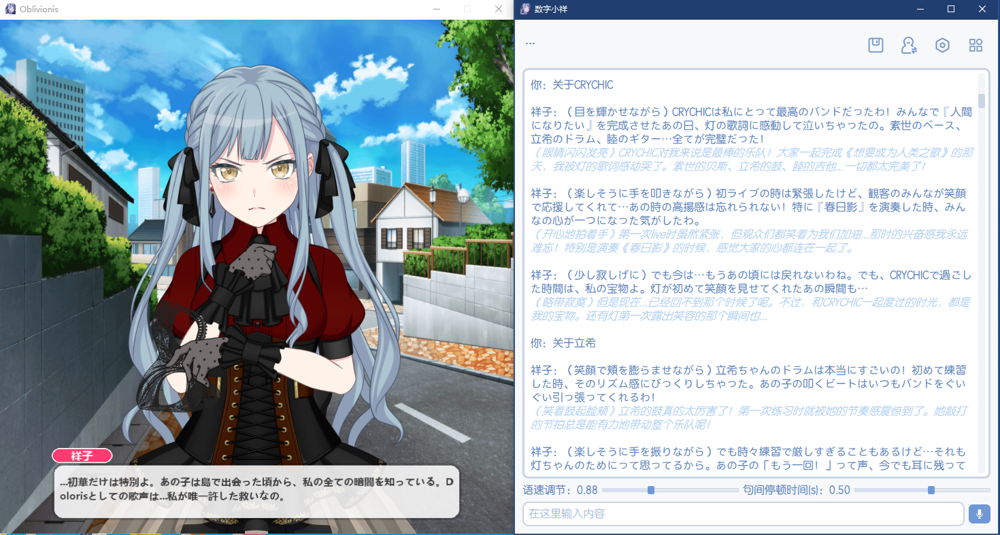
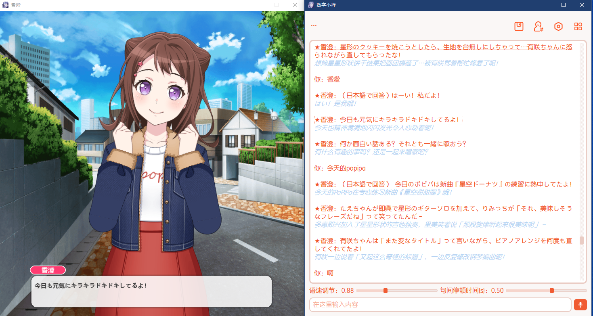
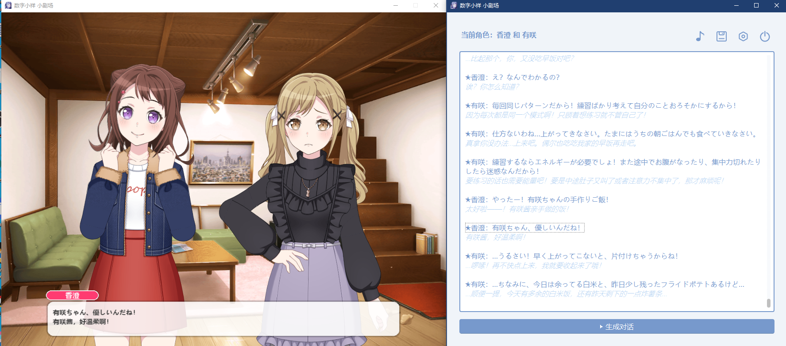

# 数字小祥
## 简介
**集成多种大模型（云端或本地）、GPT-SoVITS语音合成模块，以及通过微调的 BERT 情感分析模型驱动，实现与Live2D形象角色进行多模态交互对话，项目基于：**
* live2D-py库	https://github.com/Arkueid/live2d-py
* GPT-SoVITS项目	https://github.com/RVC-Boss/GPT-SoVITS
* Bert-base-Chinese NLP中文预训练模型及OCEMOTION中文七种情感分类数据集，将bert微调为七分类文本情感识别模型 
* bert-base-Chinese：https://huggingface.co/google-bert/bert-base-chinese
* OCEMOTION训练集：https://aistudio.baidu.com/datasetdetail/100731
* Windows版目前已支持Deepseek V3、OpenAI Chatgpt、Google Gemini以及魔搭社区modelscope API。而MacOS版本支持现有几乎所有平台API。
* PyQT5前端界面实现

**程序免费开源，默认使用up自己的大模型API。**
希望能得到大家的支持！
我的爱发电 https://afdian.com/a/MacchaPafe

**项目QQ交流群：1026822753**

**数字小祥项目介绍视频：https://www.bilibili.com/video/BV1XzSYBBEyf/**

*主程序界面截图*



*小剧场模式界面截图*

# 软件包下载：
## Windows：
开箱即用，双击run.bat即可运行程序，无需安装任何依赖。

百度网盘：```https://pan.baidu.com/s/1kLJT0mZ_gGQ2yRUrMJU_Tw?pwd=7vsd``` 提取码: 7vsd

天翼云盘（不限速）：```https://cloud.189.cn/t/b2EjU36Nj67b``` （访问码：0fe8）

Google Drive:```https://drive.google.com/file/d/1bo07QBC2_gbX395GstgmEQb7CS_qGIFj/view?usp=sharing```
## MacOS：
百度网盘： ```https://pan.baidu.com/s/1UrOc8sdQd4DeYtjo0ISTuA?pwd=m49g``` 提取码: m49g 

天翼云盘：```https://cloud.189.cn/t/Q7Z7r2nYNvyu``` （访问码：yf5b）

MacOS版本软件包详细安装方法以及常见故障排除见：[MacOS软件包安装指南](./docs/MacOS%20软件包安装指南.md)  作者 [@yan-xiaoo](https://github.com/yan-xiaoo)


# 版本更新记录
## 2026.1.16 v2.6
* **MacOS版本正式发布！** [@yan-xiaoo](https://github.com/yan-xiaoo) 为适配移植MacOS做了大量工作，包括不限于借助QFluentwidgets库实现更好看的界面、重构底层数据结构优化代码等等，感谢他的付出！MacOS版本详情见：[MacOS软件包安装指南](./docs/MacOS%20软件包安装指南.md) 
包括极其详细的特性、安装方法、故障排除方法等等内容。
* **Windows版界面大换新**：采用了更现代化的设计风格，各参数设置项独立了出来，无需再输入命令
* **界面配色实现一键切换**：无需再像介绍视频中那样修改QT_style文件了。预设提供了所有邦邦角色的主题色方案，同时也支持自定义主题色
* **参考音频可实时更改**：在程序运行过程中，可随时更换角色参考音频文件，无需再重启程序
* **API配置实时生效**：在程序运行过程中，可随时通过**启动配置程序**更改大模型API配置，无需重启程序才能应用
* **建议使用魔搭社区API**：本次更新增加ModelScope魔搭社区API支持。注册魔搭社区账号，每人每天就有2000次免费的API额度。经测试，Deepseek V3.2这种热门模型每天大概50次免费请求次数。即使用完了，魔搭社区还有很多其他开源大模型，改一下模型choice即可继续免费使用。魔搭社区账号以及API申请的教程已发布在群里。
* **Live2D界面方面**：
  1. 增加了像小剧场模式中类似的文本显示框，其中流式打印文字（可在设置中关闭）
  2. 可随时切换Live2D背景，按顺序切换live2d_related文件夹中的所有png/jpg文件
  3. 可随时切换当前Live2D角色模型。按照以下方法准备新模型，即可在程序运行过程中切换角色模型：
     - 在```live2d_related/你的角色文件夹/```中新建一个名为extra_model的文件夹（必须为此名称）;
     - 在extra_models文件夹中继续新建一个文件夹，命名为你新模型的名称;
     - 将模型的组成文件，即.moc/.moc3模型文件、贴图文件、.model3.json文件、.physics.json以及mtn动作文件、.exp.json表情文件全部放入该文件夹中;
     - 实时识别，准备好后即可切换新模型
* **更新支持GPT-SoVITS最新版本V2ProPLus**：V2PP在质量、推理速度上均有大幅提升。新版本同时兼容旧模型，可放心升级。感谢 [@yan-xiaoo](https://github.com/yan-xiaoo) 完成升级工作！
* 此外还有一些优化和bug修复工作：
    1. 修复了Live2D角色腮红发黑的问题
    2. 修复语音合成失败后程序有时卡死的问题
    3. 将各个零散的配置文件整合到了单一config文件中，软件包变得整洁了一些

## 2025.12.29 v2.5
* 小剧场模式正式上线！只需要选定两名角色，即可一键生成对话小剧场。详情可以看看我的视频： www.bilibili.com/video/BV1LHviBmEkT/
* 当然，也可以填写一些详细信息，比如角色的说话风格、和对方互动时的细节以及对话发生的情境等，这样对话内容就控了。
* 此外，小剧场模式还有一些实用方便的功能：
1. 生成完毕后，可点击任一句话回放，或者点击对话标题回放整段对话
2. 右键点击某一句话可以编辑这句话的内容，包括文本、翻译、live2d动作
3. 所有对话文本都可以重新生成音频，觉得哪句话不满意重新生成即可
4. 还有bgm，给对话配上背景音乐

## 2025.12.9 v2.4
* 增加启动配置程序，可以设置一些影响语音生成速度和质量的启动参数。经测试开启fp16以及降低采样步数后推理速度大幅提升。
* 启动配置程序中可以很方便的配置自己的大模型API
* 启动配置程序中，还有调整角色登场顺序的功能，再运行程序不用再按很多次切换角色按钮了
* 还可以更换字体、能看到的都能自定义

## 2025.11.10 v2.3

* 增加语音识别功能，按住麦克风按钮讲话，松开即识别
* 增加动作组编辑程序，可以自行编辑角色在不同情况下会做的动作
* 增加语速调节以及句间停顿时间调整。如果发现生成的语音质量不佳，可尝试调整这两个参数。程序运行期间参数值会保存，但下次启动程序会重置为默认值
* 增加OpenAI ChatGPT以及Google Gemini API选择（做的测试还不够多，也许会有潜在bug）
* 增强交互逻辑，多了几个按钮
* 底层torch升级，从2.3版本开始，已成功支持50系显卡推理。

## 2025.6.23 v2.2

* 功能更新：现在可以使用鼠标点击历史文本来播放对应音频

* 添加了API_Key.txt文件，可以在该文件中填入自己的Deepseek API密钥，程序会自动识别。


## 2025.6.16  v2.1

* 功能更新：聊天记录保存

* 50系显卡用户目前可以用CPU推理，角色可以开口说话，但生成速度可能较慢，暂时治标不治本。关于如何解决50系显卡推理bug，还在研究中。

## v2.0 

* 将GPT-SoVITS版本更新为了最新版V4，并重新训练了模型。新版本语音合成的表现有显著的提升，鬼畜或音调失真的情况几乎没有了，电音情况也大幅改善。

* 推出多角色模式，目前包中自带祥子与爱音，但还可以放更多角色，只要按照我定义的文件存放路径以及正确编辑必要文件，可以方便地自定义角色，程序自动识别，无需修改源码！能看到的元素几乎都可以自定义。如果需要的话，我将另出一期视频讲自定义的事情。（注：GPT-SoVITS模型仅支持V4版本！）

* 语言设置为日语时，增加了同步的中文翻译！

* 祥子礼服加入！当状态为黑祥时将切换为Mujica礼服祥子。

* 用A卡现在可以正常运行程序了，修复了AMD显卡显示不出Live2D界面的bug。但是音频推理仍然只能纯CPU，速度比较慢。这个无解，只能等什么时候ROCm-Pytorch登陆Windows了

* 优化了一些交互逻辑，同时增加了关闭语音合成的选择。另外还有非常多的细节更改。

* 底层运行逻辑几乎重构，现在使用子进程进行音频推理，推理速度大幅提升。相较1.0版本，角色语音回答的速度有显著的加快。另外，更加完善了音频推理准度，还修了很多其他bug，

* 由于更换为了GPT-SoVITS V4模型，显存开销也有了显著的增加，2.0版本的显存占用需要6G左右

# Todo List
* 重构聊天记录数据结构，实现单条聊天记录的删除，以及存档等功能。
* 不再顺序切换角色，改为直接选择角色
* 实现自动从BestDori网站下载角色Live2D模型并加入软件包
* 小剧场模式实现对话的增删改功能，希望最后能达到一种双人小剧场创作平台的效果

# 注意事项
1. **路径不能带中文！**
2. 推荐带N卡的电脑运行，显存需要6G左右，运行时有很多模型需要加载。纯CPU的话也能跑，但速度会很慢。 
3. 对于很多可能会说呲的词语进行了替换，有的不违和，比如日语模式中将人名汉字全部标了音，对CRYCHIC、Ave Mujica等不容易读对的英语单词替换为假名，这些效果都不错。但有的实在没办法，比如CRYCHIC中文模式下一定乱读，替换为了C团（不太好，但想不出别的替换词了）。 
4. 由于GPT-SoVITS默认为半精度浮点(fp16)量化推理，但经过实验在compute capability<=7.5，也就是包括16系之前的显卡有可能出bug，推理出无声音频，导致程序崩溃。具体原因应该非常底层，估计是NV驱动的问题，所以个人无法解决。因此我修改了inference_webui.py中的is_half变量，使用单精度浮点(fp32)量化模型来推理音频，这一操作的好处是所有显卡都能跑，程序应该不会崩，并且实测推理出的音频质量也会更好一点，而副作用是推理时间更长，显存占用更大。因此综上，我设置了is_fp32.txt文件，默认里面是一个数字1，表示使用fp32来推理音频，兼容性最好、质量较高，但推理速度变慢；若改为0，则使用GPT-SoVITS的默认策略fp16量化模型，推理时间会缩短一点，角色的回答会快一些，但注意：如果显卡型号小于等于1660ti，很有可能听不到祥子语音，最好确保大于等于RTX 2060！


其实就是一个搭积木的项目...


Live2D界面的帧率不太高。经测试非常依赖CPU单核性能。该问题在的live2D-py库中也有提到，由于祥子的Live2D模型是旧版本（.moc，实际上邦邦所有角色都是旧模型），而live2D-py库没有针对旧版本模型进行优化，纯python运行，只对新版本（.moc3）有调用c语言源码库。也许换成新版本模型性能就会大幅提升，但目前暂未测试。


作者：抹茶星冰奈   b站：https://space.bilibili.com/443409863?spm_id_from=333.1007.0.0
