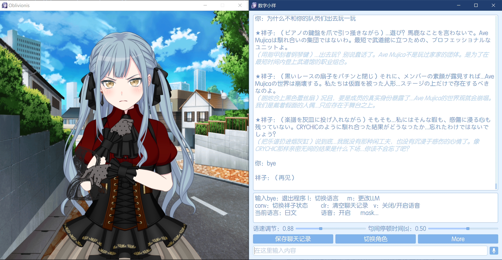
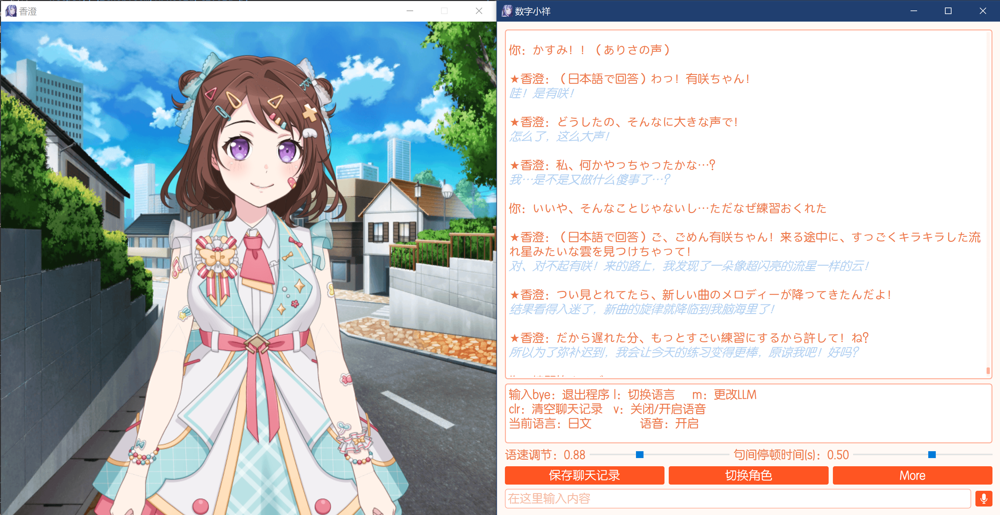

## 数字小祥
**借助云端/本地大模型API以及GPT-SoVITS框架实现与Live2D形象的人物进行语音对话，项目基于：**
* live2D-py库	https://github.com/Arkueid/live2d-py
* GPT-SoVITS项目	https://github.com/RVC-Boss/GPT-SoVITS（对一些文件源码进行了改动以适应本项目）
* Bert-base-Chinese NLP中文预训练模型及OCEMOTION中文七种情感分类数据集，将bert微调为七分类文本情感识别模型 
* bert-base-Chinese：https://huggingface.co/google-bert/bert-base-chinese
* OCEMOTION训练集：https://aistudio.baidu.com/datasetdetail/100731
* Deepseek V3 在线API调用，以及PyQT5前端界面

**程序免费开源，使用up自己的大模型API，希望大家可以多多支持！
我的爱发电 https://afdian.com/a/MacchaPafe**

**介绍视频：https://www.bilibili.com/video/BV1XzSYBBEyf/**

## 程序包下载：
开箱即用，双击run.bat即可打开程序，无需安装任何依赖（代价是所有库都塞了进去，解压后的文件夹比较大）

百度网盘：https://pan.baidu.com/s/1kLJT0mZ_gGQ2yRUrMJU_Tw?pwd=7vsd 提取码: 7vsd

天翼云盘（不限速）：https://cloud.189.cn/t/b2EjU36Nj67b（访问码：0fe8）

Google Drive: https://drive.google.com/file/d/1bo07QBC2_gbX395GstgmEQb7CS_qGIFj/view?usp=sharing

## 2025.12.9 v2.4
* 增加启动配置程序，可以设置一些影响语音生成速度和质量的启动参数。经测试开启fp16以及降低采样步数后推理速度大幅提升。
* 启动配置程序中可以很方便的配置自己的大模型API
* 启动配置程序中，还有调整角色登场顺序的功能，再运行程序不用再按很多次切换角色按钮了
* 还可以更换字体、能看到的都能自定义

## 2025.11.10 v2.3

* 增加语音识别功能，按住麦克风按钮讲话，松开即识别
* 增加动作组编辑程序，可以自行编辑角色在不同情况下会做的动作
* 增加语速调节以及句间停顿时间调整。如果发现生成的语音质量不佳，可尝试调整这两个参数。程序运行期间参数值会保存，但下次启动程序会重置为默认值
* 增加OpenAI ChatGPT以及Google Gemini API选择（做的测试还不够多，也许会有潜在bug）
* 增强交互逻辑，多了几个按钮
* 底层torch升级，从2.3版本开始，已成功支持50系显卡推理。

## 2025.6.23 v2.2

* 功能更新：现在可以使用鼠标点击历史文本来播放对应音频

* 添加了API_Key.txt文件，可以在该文件中填入自己的Deepseek API密钥，程序会自动识别。

## 2025.6.16  v2.1

* 功能更新：聊天记录保存

* 50系显卡用户目前可以用CPU推理，角色可以开口说话，但生成速度可能较慢，暂时治标不治本。关于如何解决50系显卡推理bug，还在研究中。

## v2.0 更新项目：

* 将GPT-SoVITS版本更新为了最新版V4，并重新训练了模型。新版本语音合成的表现有显著的提升，鬼畜或音调失真的情况几乎没有了，电音情况也大幅改善。

* 推出多角色模式，目前包中自带祥子与爱音，但还可以放更多角色，只要按照我定义的文件存放路径以及正确编辑必要文件，可以方便地自定义角色，程序自动识别，无需修改源码！能看到的元素几乎都可以自定义。如果需要的话，我将另出一期视频讲自定义的事情。（注：GPT-SoVITS模型仅支持V4版本！）

* 语言设置为日语时，增加了同步的中文翻译！

* 祥子礼服加入！当状态为黑祥时将切换为Mujica礼服祥子。

* 用A卡现在可以正常运行程序了，修复了AMD显卡显示不出Live2D界面的bug。但是音频推理仍然只能纯CPU，速度比较慢。这个无解，只能等什么时候ROCm-Pytorch登陆Windows了

* 优化了一些交互逻辑，同时增加了关闭语音合成的选择。另外还有非常多的细节更改。

* 底层运行逻辑几乎重构，现在使用子进程进行音频推理，推理速度大幅提升。相较1.0版本，角色语音回答的速度有显著的加快。另外，更加完善了音频推理准度，还修了很多其他bug，

* 由于更换为了GPT-SoVITS V4模型，显存开销也有了显著的增加，2.0版本的显存占用需要6G左右

## 注意事项
1. 路径不能带中文！
2. 推荐带N卡的电脑运行，显存需要6G左右，运行时有很多模型需要加载。纯CPU的话也能跑，但速度会很慢。 
3. 对于很多可能会说呲的词语进行了替换，有的不违和，比如日语模式中将人名汉字全部标了音，对CRYCHIC、Ave Mujica等不容易读对的英语单词替换为假名，这些效果都不错。但有的实在没办法，比如CRYCHIC中文模式下一定乱读，替换为了C团（不太好，但想不出别的替换词了）。 
4. 由于GPT-SoVITS默认为半精度浮点(fp16)量化推理，但经过实验在compute capability<=7.5，也就是包括16系之前的显卡有可能出bug，推理出无声音频，导致程序崩溃。具体原因应该非常底层，估计是NV驱动的问题，所以个人无法解决。因此我修改了inference_webui.py中的is_half变量，使用单精度浮点(fp32)量化模型来推理音频，这一操作的好处是所有显卡都能跑，程序应该不会崩，并且实测推理出的音频质量也会更好一点，而副作用是推理时间更长，显存占用更大。因此综上，我设置了is_fp32.txt文件，默认里面是一个数字1，表示使用fp32来推理音频，兼容性最好、质量较高，但推理速度变慢；若改为0，则使用GPT-SoVITS的默认策略fp16量化模型，推理时间会缩短一点，角色的回答会快一些，但注意：如果显卡型号小于等于1660ti，很有可能听不到祥子语音，最好确保大于等于RTX 2060！

其实就是一个搭积木的项目...

语音合成稍微慢了些。该问题是GPT-SoVITS项目的特性决定的，它并不为实时输出音频而设计，而是以输出质量为优先，调用了很多模型，同时数据预处理工序也十分复杂。

另外Live2D界面的帧率也不高，3800X算出来只有不到30帧。经测试非常依赖CPU单核性能。该问题在的live2D-py库中也有提到，因为祥子的Live2D模型是旧版本（.moc，实际上邦邦所有角色都是旧模型），而live2D-py库没有针对旧版本模型进行优化，纯python运行，只对新版本（.moc3）有调用c语言源码库。也许换成新版本模型性能就会大幅提升，但目前暂未测试。

目前正挂到github上	https://github.com/MacchaPafe/D_sakiko

作者：抹茶星冰奈   b站：https://space.bilibili.com/443409863?spm_id_from=333.1007.0.0
