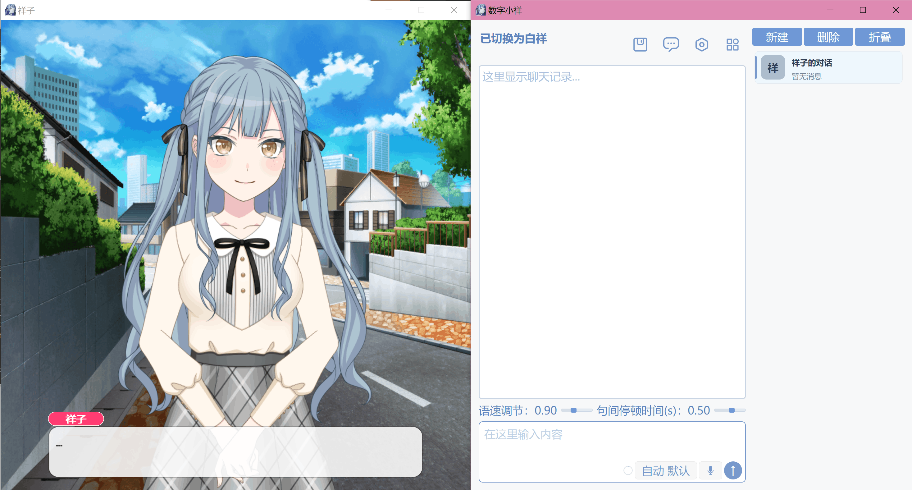
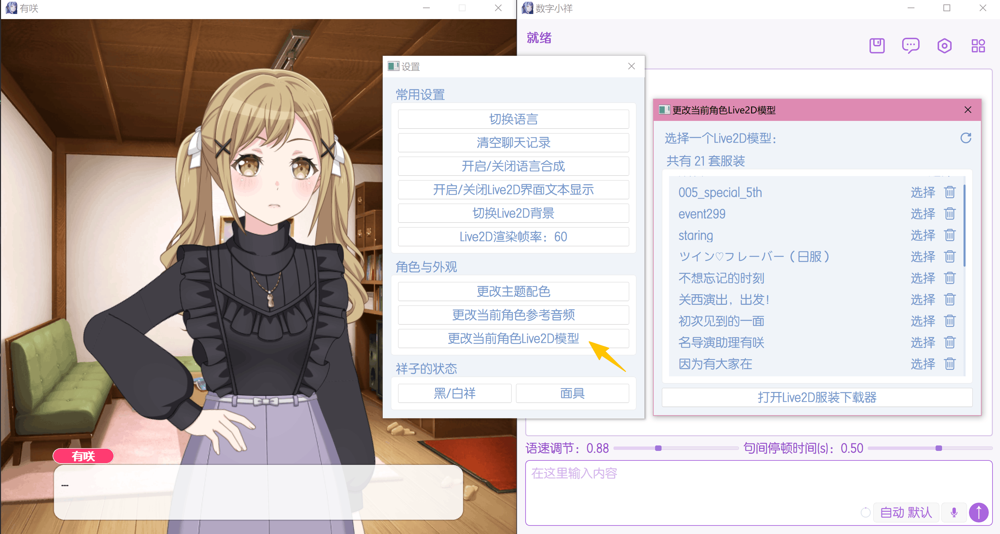
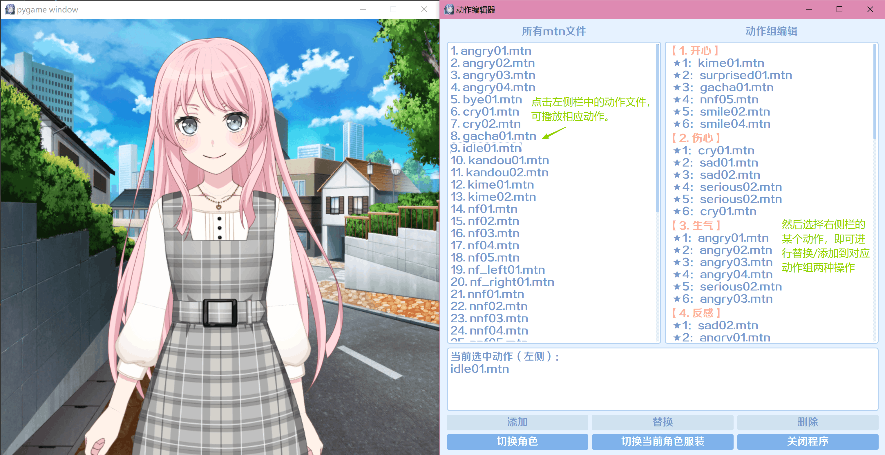
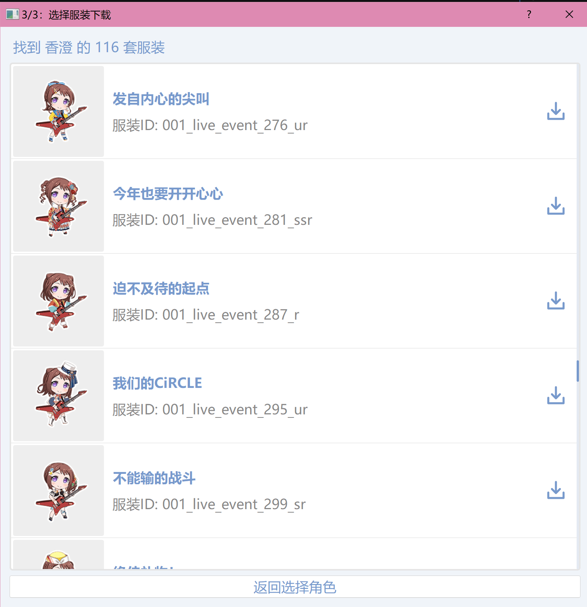
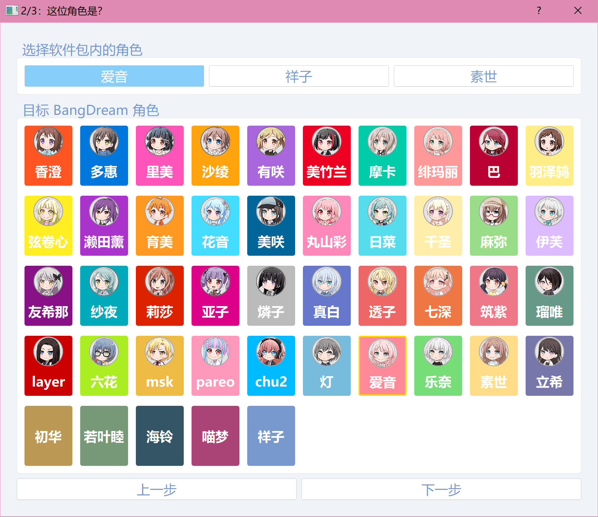
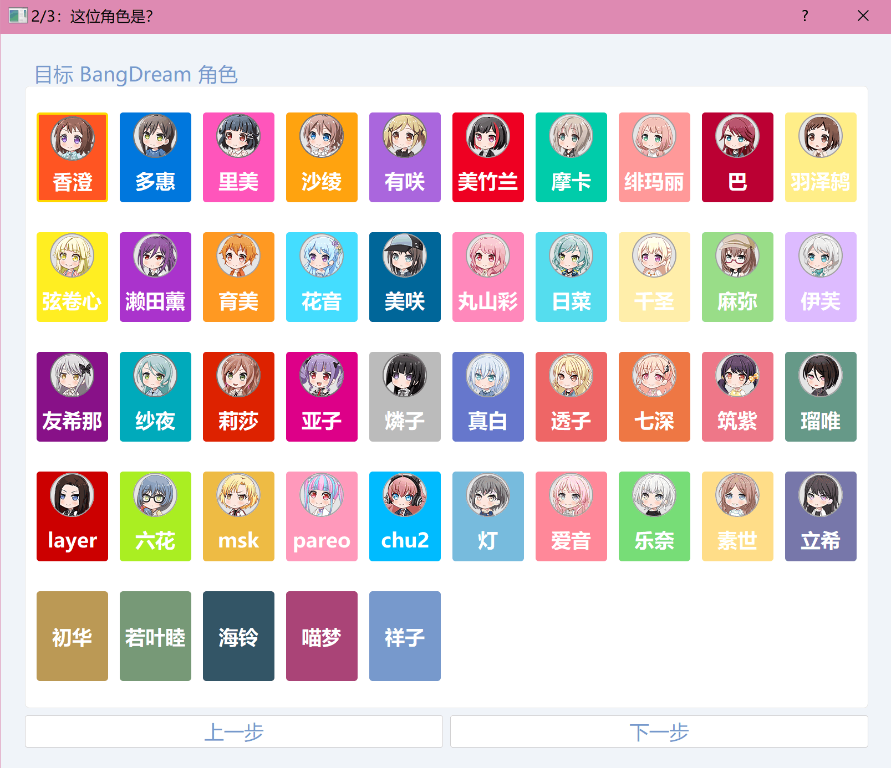

# Live2D 模块

Live2D 模块负责显示角色立绘，并让角色在聊天、思考、说话、切换角色等场景中做出动作。主程序左侧的角色窗口就是 Live2D 窗口。


<p align="center" style="color: gray; font-size: 0.9em; margin-top: -10px;"><i>图：主程序中位于左侧的 Live2D 角色展示与交互窗口</i></p>

## Live2D 模块能做什么

在数字小祥中，Live2D 会和聊天流程联动：

- 角色说话时，会根据这句话的情绪播放对应动作，嘴型也会跟随语音变化。
- 等待 AI 回复时，角色会播放思考动作。
- 长时间没有聊天时，角色会播放待机动作。
- 切换角色时，角色会播放登场动作。
- 退出程序时，角色会播放离场动作。
- 语音较长时，角色会适当补充动作，避免一直停在同一个姿势。

简单说，Live2D 模块负责让角色生动起来。

## 角色模型由哪些内容组成

每个角色的每套立绘都是一套单独的 Live2D 模型。例如同一个角色的常服、演出服、活动服，都是不同的模型。

如果你是通过软件内置的 Live2D 下载器添加模型，一般不需要手动整理文件，下载器会自动部署好。

::: tip
如果你不想深入了解 Live2D，只需要记住：不要把模型文件夹里的文件拆开移动，也不要随意改文件名。否则可能出现模型打不开、贴图丢失、动作不播放等问题。
:::

::: details 如果你想手动整理模型文件
一套模型通常包含：

- 模型入口文件，本软件中一般叫 `3.model.json`
- 角色身体和贴图文件(.png)
- 动作文件(.mtn)，用来表现开心、伤心、思考、待机等状态
- 表情(.exp.json)和物理效果(.physics.json)文件，部分模型可能没有

如果你想手动为软件包添加角色或已有角色的新模型，可参考[自带角色](#模型文件放在哪里)的文件安排目录。
:::

## 模型文件放在哪里

Live2D 相关文件主要放在软件根目录下的：

```text
live2d_related/
```

软件包自带角色有爱音、祥子、素世，三位角色的 Live2D 模型所在目录分别是：

```text
live2d_related/anon/
live2d_related/sakiko/
live2d_related/soyo/
```

三位角色各有一套默认模型（常服）和一套演出服。

每个角色通常有这样的目录结构：

```text
live2d_related/
└─ 角色文件夹名/
   ├─ name.txt
   ├─ character_description.txt
   ├─ live2D_model/
   └─ extra_model/
```

其中：

- `name.txt`：角色在软件界面显示的名字。
- `character_description.txt`：角色描述文本。内容会发给大模型告诉它应该扮演怎样的一位角色。
- `live2D_model/`：角色默认服装模型。
- `extra_model/`：角色额外服装模型。

默认服装模型放在：

```text
live2d_related/角色文件夹名/live2D_model/
```

额外服装模型放在：

```text
live2d_related/角色文件夹名/extra_model/服装名/
```

例如：

```text
live2d_related/soyo/live2D_model/
live2d_related/soyo/extra_model/演出服/
```

## 服装与模型切换

一个角色可以有多套 Live2D 服装。

- 默认服装放在 `live2D_model/`。
- 额外服装放在 `extra_model/服装名/`。

你可以手动为角色添加新服装模型，也可以使用 Live2D 下载器自动下载并添加新服装。为已有角色添加新服装后，可以在主程序设置菜单中切换角色立绘。


<p align="center" style="color: gray; font-size: 0.9em; margin-top: -10px;"><i>图：在系统设置中，可为当前角色一键切换已部署的服装模型</i></p>

::: tip
如果你刚刚手动添加了新模型，但主程序里没有显示，建议先重启软件。
:::

## 动作组

角色说话时会做动作，但并不是随便播放某个动作文件，而是按“动作组”来选择。

动作组可以理解为：**一类场景下可选择的多个动作的集合**。

例如：

- “开心”动作组里可以放笑、挥手、点头等动作。
- “伤心”动作组里可以放难过、低头等动作。
- “思考”动作组里可以放思考、犹豫等动作。

当角色说的话被判断为“开心”时，程序就会从开心动作组里随机挑选一个动作播放。

### 情绪动作组

角色说话时，常用的情绪动作组有 7 类：

| 情绪 | 常见表现 |
| --- | --- |
| 开心 | 高兴、轻快、积极 |
| 伤心 | 难过、失落、委屈 |
| 生气 | 不满、恼火、强烈反驳 |
| 反感 | 嫌弃、抗拒、不情愿 |
| 喜欢 | 亲近、害羞、好感 |
| 惊讶 | 意外、震惊、突然反应 |
| 害怕 | 紧张、害怕、不安 |

软件会根据模型回复中的情绪标签自动选择动作组。用户通常只需要调整每个动作组里有哪些动作。

### 事件动作组

除了聊天情绪，还有一些固定事件会触发动作：

| 场景 | 说明 |
| --- | --- |
| 待机 | 一段时间没有聊天时播放 |
| 思考 | 等待大模型回复时播放 |
| 登场 | 切换角色时播放 |
| 离场 | 退出程序时播放 |
| 按下语音按钮 | 用户开始语音输入时播放 |
| 普通待机恢复 | 说话结束后回到自然待机状态 |

这些动作同样可以通过动作组编辑程序调整。

### 编辑角色动作组

软件开放了各种场景下角色动作组的编辑权限。

你可以双击根目录下的`运行动作组编辑程序.bat`(Windows)/`运行动作组编辑程序.command`(macos)或在主程序的``更多功能`菜单中开启动作组编辑程序。

打开动作组编辑程序。

动作组编辑程序可以做这些事：

- 查看当前模型文件夹里的所有动作。
- 点击动作进行预览。
- 查看当前模型已经配置好的动作组。
- 向某个动作组添加动作。
- 替换动作组里的动作。
- 删除动作组里的动作。
- 为同一角色的不同服装分别配置动作组。


<p align="center" style="color: gray; font-size: 0.9em; margin-top: -10px;"><i>图：动作组编辑程序，支持预览动作，并将动作添加或替换到不同动作组中</i></p>

#### 推荐编辑流程

1. 打开动作组编辑程序。
2. 切换到想编辑动作组的角色。
3. 如果该角色有多套服装，先切换到要编辑的服装。
4. 在左侧点击动作进行预览。
5. 在右侧选择要修改的动作组。
6. 使用“添加”“替换”“删除”调整动作。
7. 回到主程序测试聊天效果。

::: warning
祥子的动作组暂时不能编辑。
:::

::: tip
不同模型的动作风格差异很大。即使是同一个角色，不同服装的动作也可能不完全适合。如果你发现某套服装说话时动作很奇怪，可以单独为这套服装调整动作组，不会影响默认服装。
:::

## Live2D 下载器

为了方便大家添加角色模型，免去以前到处找文件、下载、解压、挪文件夹的繁琐流程，自 2.6.5 版本起，软件内置了 **Live2D 下载器**。下载器可以一键获取官方角色模型并自动部署好，轻松搞定。

下载器有两种用途：

- 为已有角色添加新服装。
- 添加全新角色到软件包。

<p align="center"></p>
<p align="center" style="color: gray; font-size: 0.9em; margin-top: -5px;"><i>图：Live2D 下载器界面，展示该角色可下载的服装列表</i></p>

你可以双击根目录的`运行Live2D模型下载器.bat`(Windows)/`运行Live2D模型下载器.command`(macos)或在主程序的``更多功能`菜单中开启Live2D下载器。

### 为已有角色添加新服装

当软件里已经有这个角色，而你只是想给她添加一套新服装时，选择这个方式。

<p align="center"></p>
<p align="center" style="color: gray; font-size: 0.9em; margin-top: -5px;"><i>图：向本地已有角色追加部署新的服装文件</i></p>

下载完成后，新服装模型文件会保存到：

```text
live2d_related/角色名/extra_model/服装名/
```

这种方式的特点：

- 不会新增角色。
- 原有聊天记录不受影响。
- 原有语音模型不受影响。
- 新服装可以在主程序中切换使用。
- 新服装的动作组会先沿用默认模型的结构，之后可以再手动调整。

### 添加全新角色

当软件里还没有这个角色，而你想把她作为新角色加入软件时，选择这个方式。

<p align="center"></p>
<p align="center" style="color: gray; font-size: 0.9em; margin-top: -5px;"><i>图：作为全新角色下载模型，并部署所有必需文件</i></p>

下载完成后，会创建新角色目录，并生成基础文件。生成内容包括：

```text
live2d_related/新角色文件夹名/
reference_audio/新角色文件夹名/
```

其中，本次下载时选择的服装会作为该角色的默认模型。

::: warning
添加全新角色后，需要重启软件才能生效。
:::

新角色会自动生成一份基础角色描述。你可以之后手动编辑：

```text
live2d_related/角色文件夹名/character_description.txt
```

也可以打开`启动参数配置.bat`在详细配置中修改角色描述。

::: tip
从这里添加的新角色不包含GPT-SoVITS语音模型，因此直接聊天是无法进行语音合成的。可以自行寻找角色的GPT-SoVITS模型文件，放到`reference_audio/新角色文件夹名/GPT-SoVITS_models`中。详情可见[语音合成模块的相关说明](./tts.md#如何配置角色语音模型)
:::

## 背景图片

Live2D 窗口支持切换背景图片。

背景图片放在：

```text
live2d_related/
```

支持格式：

```text
.jpg
.png
```

在主程序设置菜单中点击“切换 Live2D 背景”，即可按顺序切换背景。

::: tip
背景图片不会在运行中自动刷新。如果你刚刚放入新图片，需要重启软件后才能切换到它。
:::

## 帧率设置

Live2D 窗口支持切换帧率：

```text
30 FPS
60 FPS
120 FPS
```

如果不确定该选哪个，保持默认即可。电脑配置较低或窗口卡顿时，可以尝试切换到 `30 FPS`。

## 角色说话文本显示

Live2D 窗口底部区域可以显示角色当前说话文本。

如果你希望 Live2D 窗口更干净，也可以在设置菜单中关闭文本显示。


## 常见问题

1. **为什么 Live2D 下载器下载完成了，但主程序里找不到新角色？**

> A: 新增全新角色后需要重启软件；已有角色的新服装则通常可以直接切换。

2. **模型出现抖动或动作播放异常的情况**

> A: 官方给的动作文件通常仅适配对应的角色模型，为其他角色甚至同角色其他服装模型应用可能就会出现播放异常情况。可以在[动作组编辑程序](#编辑角色动作组)中换掉异常动作文件。

3. **为什么某个动作文件明明存在，但聊天时从来不会播放？**

> A: 动作文件需要被加入对应动作组，单独存在于文件夹里不会自动参与随机播放。

4. **为什么我新增了背景图片，但切换背景时看不到？**

> A: 背景图片列表不会实时刷新，新增图片到`live2d_related`文件夹后需要重启软件。

5. **为什么添加新服装后，动作组还是原来的？**

> A: 这是正常的。给已有角色添加新服装时，会先沿用默认模型的动作组结构，之后可以手动调整。

6. **手动放进去的模型无法加载、打不开**

> A: 可能是模型文件不完整、文件名被改动、模型格式不适配，或者文件夹结构被打乱。请先对照"[角色模型由哪些内容组成](#角色模型由哪些内容组成)"这一节中所述的模型文件清单，看是否某类文件有缺少。

7. **下载器里有些服装下载失败**

> A: 可能是网络不稳定、下载源暂时访问失败，或者Bestdori中该模型的文件有缺失。尝试多次还是失败后建议只能放弃了。

8. **为什么动作组编辑程序里祥子不能编辑？**

> A: 目前祥子的模型和状态切换比较特殊，所以暂时没有开放动作组编辑。

9. **从下载器添加的新角色无法讲话（不能合成语音）**

> A: 从下载器添加的新角色不包含GPT-SoVITS语音模型。可以自行上网寻找角色的GPT-SoVITS模型文件，放到`reference_audio/新角色文件夹名/GPT-SoVITS_models`中