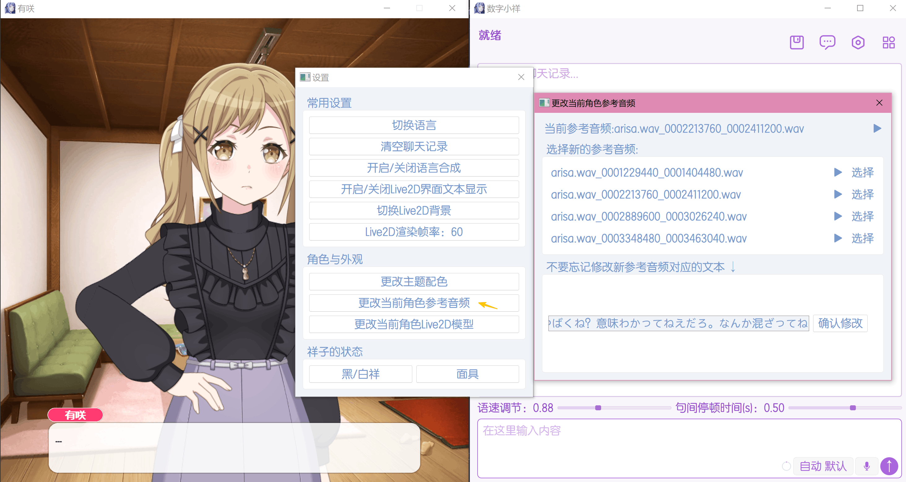

# 语音合成模块（GPT-SoVITS）

数字小祥中的语音合成功能借由 GPT-SoVITS 开源项目实现，项目Github源仓库：
``` text
https://github.com/RVC-Boss/GPT-SoVITS
```

简单来说，它会把 AI 回复的文字转换成角色语音，让角色不只是“回复消息”，而是用自己的声音说出来。

本页主要说明：语音模型需要哪些文件、这些文件应该放在哪里、参考音频和参考文本怎么准备，以及如何在程序内临时切换参考音频。

## GPT-SoVITS 是什么

GPT-SoVITS 是一套语音合成方案。它需要两类东西：

- **角色语音模型**：决定角色说话的声线和音色。它由角色相关语音素材训练得来，提供基础声线特征。
- **参考音频与参考文本**：决定这一次说话更接近哪种语气、节奏和状态。

你可以把它理解成：模型提供角色的声音基础，参考音频提供本次合成时的语气参考。参考音频选得越合适，生成出来的语音通常越自然。

::: tip
更换参考音频不会重新训练模型，它只是合成时使用的一段“声音参考”。所以切换参考音频很快，数字小祥中支持实时调整。
:::

## 一套角色语音需要哪些文件

每个角色的语音文件一般放在 `reference_audio/角色文件夹名/` 下面。

数字小祥中，文件结构需要像这样安排（可参考`"\reference_audio\anon"`文件夹内结构）：

```text
reference_audio/
└─ 角色文件夹名/
   ├─ GPT-SoVITS_models/
   │  ├─ 角色模型.ckpt
   │  └─ 角色模型.pth
   ├─ reference_text.txt
   ├─ reference_audio_language.txt
   ├─ 参考音频.wav
   ├─ 其他参考音频.wav
   ├─ QT_style.json
   └─ default_ref_audio.txt
```

每个文件的功能或作用如下：

| 文件 | 作用 |
| --- | --- |
| `.ckpt` 文件 | GPT-SoVITS 需要的语音模型文件之一 |
| `.pth` 文件 | GPT-SoVITS 需要的语音模型文件之一 |
| `参考音频.wav` / `参考音频.mp3` | 合成时使用的声音参考 |
| `reference_text.txt` | 当前参考音频对应的文字内容 |
| `reference_audio_language.txt` | 参考音频使用的语言 |
| `default_ref_audio.txt` | 记录当前默认使用哪一段参考音频，由程序自动维护，无需理会 |
| `QT_style.json` | 程序内部历史遗留问题，无需理会 |

::: warning
 `.ckpt`、`.pth`、参考音频以及参考文本，四者缺一不可，否则角色无法进行语音合成，只能进行无声聊天。运行程序后终端黑窗口会提示是否有角色缺必要文件。
:::

## 参考音频及其选择

参考音频会明显影响合成效果。建议优先选择这样的音频：

- 时长在 **3 到 6 秒** 。
- 只有一个人说话，没有其他人插话。
- 没有明显背景音乐、杂音、回声，音频干净。
- 音量正常，不要爆音，也不要太小。
- 语气接近你希望角色说话时的状态。
- 文字内容清楚，方便准确写出对应文本。

不推荐的参考音频：

- 太短或太长的音频。
- 有 BGM、环境噪音、混响很重的音频。
- 多人对话、笑声过多、语气过于夸张的音频。
- 音频内容和参考文本对不上。

::: tip
如果是邦邦角色，可以直接从原动画中截取一段音频当参考音频。但要注意去掉背景杂声比如BGM等，只保留纯净人声。可借助 [UVR5](https://ultimatevocalremover.com/) 这个人声提取软件完成。
:::

选好音频后（wav或mp3均可），把文件复制到`reference_audio/角色文件夹名/` 下面。你可以放不止一个参考音频文件，比如多个不同语气都各放一条。程序支持多段参考音频文件，想切换时在程序设置菜单中随时更改即可，详情见[程序运行时切换参考音频](#程序运行时切换参考音频)。


## 参考音频语言

`reference_audio_language.txt` 用来告诉程序参考音频是什么语言。

双击打开该文件，可以看到以下内容：

```text
#填写说明：只需把下面的数字3修改为其他数字即可，范围为1-11，分别对应你的参考音频语言为   1：中文  2：英文  3：日文  4：粤语  5：韩文  6：中英混合  7：日英混合  8：粤英混合  9：韩英混合  10：多语种混合  11：多语种混合（粤语） 
#不能有任何其他内容，包括空格、换行、缩进等，否则会报错
3
```

如果你的参考音频不是日语，你只需要把最后一行的数字`3`改掉改成其他语言的编号，其他内容请不要改动。

## 参考文本

`reference_text.txt` 里填写的是参考音频的文字内容。它必须和参考音频里角色说的话保持一致。

例如参考音频里角色说的是：

```text
今天也一起加油吧。
```

那么参考文本就应该写成同样的内容，不要写成另一句话，也不要漏掉任何语气词。

**写参考文本时要注意：**

- 中文、日文间不要混乱标注，尤其是日文汉字和中文汉字，以及中文中不要出现日文假名。
- 如果参考音频里有明显停顿，可以用逗号或句号自然分开。

:::tip
如果你不想手动打开文件夹再打开txt文件修改，可以直接在程序运行时打开设置菜单对应选项来修改。换句话说，数字小祥程序支持在程序内部、用图形化界面就搞定这些工作。详情可见下文的[程序运行时切换参考音频](#程序运行时切换参考音频)。
:::

## 如何配置角色语音模型

综合上面的知识，为角色配置GPT-SoVITS语音模型需要完成以下步骤：

1. 打开项目目录中的 `reference_audio/角色文件夹名/`（若没有则创建）；
2. 把参考音频放在角色文件夹下，支持 `.wav` 或 `.mp3`，支持放入多个文件；
3. 在 `reference_text.txt` 中写入参考音频对应的文字；
4. 在 `reference_audio_language.txt` 中填写参考音频语言；
5. 把角色 `.ckpt` 和 `.pth` 模型文件放进 `GPT-SoVITS_models/` 文件夹。
6. 重新启动程序，或重新进入对应角色，让程序读取新的配置。


::: tip
如果你使用live2D下载器为软件包添加了新角色，那么程序会自动创建一部分默认文件和文件夹。你只需要把模型和参考音频放到对应位置，然后补好参考文本与语言即可。[*什么是Live2D下载器*](live2d.md#live2d-下载器)
:::

## 程序运行时切换参考音频

如果你为同一个角色准备了多段参考音频，可以在程序内快速切换。

首先打开设置菜单，点击`更改当前角色参考音频`，弹出如下图的窗口：


<p align="center" style="color: gray; font-size: 0.9em; margin-top: -10px;"><i>图：更改参考音频窗口</i></p>

程序会扫描`reference_audio/角色文件夹名/`下的所有`.wav`和`.mp3`文件，把它们都当成参考音频展示在这里。你可以点击播放按钮先试听，然后选择你想要更换的那一条即可。不过一定注意，更换后别忘了修改下方对应的参考文本，这非常重要，否则角色容易胡言乱语。

该功能适合用来快速切换不同说话状态，比如：

- 普通语气；
- 开心语气；
- 低落语气；
- 认真语气；
- 更温柔或更活泼的语气。

::: tip
切换参考音频不会改变角色模型本身。它只会影响之后生成语音时使用的参考状态。
:::

::: tip
对于角色回复的历史消息，如果你觉得生成质量不满意或想换个参考音频再讲一次，可以右键对应消息，选择重新生成语音，让程序使用当前设置重新合成。
:::

### 修改后什么时候生效

切换参考音频和参考文本后，**下一次生成语音** 就会使用新的设置。


## 语音合成等待时间

语音合成需要加载模型并进行推理，所以有时会等待一小段时间。尤其是第一次合成、切换不同角色后，等待时间可能会明显。

影响速度的常见因素包括：

- 电脑显卡和显存情况。（经测试最好要有一张6G及以上显存的N卡，可以流畅运行）
- 要合成的文本长度。
- 是否刚刚切换过角色或模型。
- 后台是否还有其他占用显存的软件。

如果一句回复很长，程序可能会把它分成多段音频分别合成。等待时请尽量不要频繁重复点击，以免同时排队过多任务。

## 语速和停顿时间调节
在右侧聊天界面中，还可以见到`语速调节`和`句间停顿时间调节`滑钮。顾名思义，可以调节角色讲话的语速以及语气停顿的时间长短。这两个参数也会一定程度影响生成质量，如果你觉得讲话不太自然，可尝试调节一下。


## 常见问题

1. “更改当前角色参考音频”按钮不可用？

> A: 通常是当前角色语音模型配置不完整。请检查角色是否已经正确配置 GPT 模型、SoVITS 模型和参考音频、参考文本等。[如何配置角色语音模型](#如何配置角色语音模型)

2. 生成出来的语音不像角色？

>A: 可以尝试：
>- 换一段更清晰的参考音频。
>- 确认参考文本和音频内容一致。
>- 确认参考音频语言填写正确。
>- 避免使用有背景音乐或多人声音的参考音频。
>- 检查是否放错了角色模型文件。

3. 角色发音很奇怪/胡言乱语？

>A: 常见原因是参考文本、参考音频语言或输入文本语言与参考音频不匹配。比如参考音频是日文，但语言配置写成中文；或者切换参考音频后忘记修改参考文本，角色就很有可能发音奇怪。

4. 改了参考音频但历史语音没变化？

>A: 已经生成过的音频文件不会自动变化。需要对那条消息重新生成语音，或者等待下一条新回复生成。

