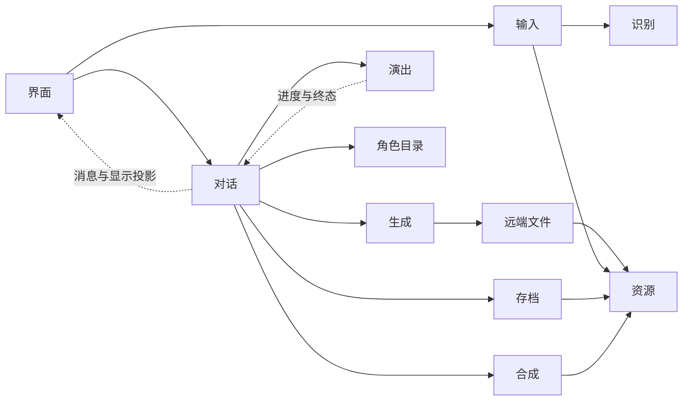

# 核心模块接口原型

本文链接的 `interface.js` / `interface.py` 文件继续用于审查模块职责和调用方式，方法体保留为空。可运行原型已经通过同目录新增的实现文件接入应用启动；实现范围、入口和未覆盖部分见 [原型说明](prototype.md)。不能直接实例化接口审查文件，或将本文的完整设计范围视为本轮已经全部实现。

模型与工具调用的独立选型验证见 [AI SDK 使用与接口验证](ai-sdk-demo.md)。

参数和返回值中的必要属性使用 `@typedef` 描述。没有声明公开的属性均由模块内部管理；调用方不得通过读取队列、修改 Chat 对象或访问 SDK 实例完成业务操作。构造与依赖装配留到实现阶段，不在原型中公开各模块的内部组成。

## 阅读顺序

| 模块                    | 接口文件                                                                 | 对外负责                                                | 不接收或不承担                                   |
| ----------------------- | ------------------------------------------------------------------------ | ------------------------------------------------------- | ------------------------------------------------ |
| 对话 `Conversations`    | [conversation/interface.js](../src/backend/conversation/interface.js)    | 接收用户意图，管理多个 Chat，编排生成、存档、合成和演出 | 动作计时、推理池、模型实例、连接细节             |
| 生成 `Agent`            | [llm/interface.js](../src/backend/llm/interface.js)                      | 基于一次请求完成模型与工具循环，返回完整校验后的台词    | 完整可修改 Chat、前后台、TTS、sequence、消息落盘 |
| 演出 `Performance`      | [performance/interface.js](../src/renderer/src/performance/interface.js) | 场景、sequence、音频、字幕、Live2D 与全部播放进度       | Chat、Turn、合成状态、取消原因、对话编排         |
| 合成 `Speech`           | [speech/interface.js](../src/backend/speech/interface.js)                | 转换输入和结果，提交、查询、控制并等待 Python 合成任务  | 调度队列、模型实例、对话归属、失败展示策略       |
| 识别 `Recognition`      | [recognition/interface.js](../src/backend/recognition/interface.js)      | 将录音转换成文本，管理识别模型                          | 麦克风录制、草稿、光标、自动发送                 |
| 存档 `ChatStore`        | [storage/interface.js](../src/backend/storage/interface.js)              | 版本校验、原子持久化、迁移、归档                        | 历史裁剪规则、运行任务、演出进度                 |
| 角色 `CharacterCatalog` | [characters/interface.js](../src/backend/characters/interface.js)        | 角色与对话身份定义的存取、身份与能力解析                | 当前 Chat、自动替换已有快照、模型加载与推理      |
| 资源 `MediaAssets`      | [resources/interface.js](../src/backend/resources/interface.js)          | 文件导入、访问寻址、引用和回收                          | 对话业务、文件应在哪一句播放、历史删除决策       |
| 远端文件 `RemoteFiles`  | [remote-files/interface.js](../src/backend/remote-files/interface.js)    | 厂商文件上传复用、引用失效、显式删除与自动回收          | Chat、输入框状态、生成流程重试、任意账号文件管理 |
| 输入 `InputSessions`    | [input-sessions.js](../src/renderer/src/features/chat/input-sessions.js) | 每个对话的草稿、录音、附件和识别文本插入                | Agent、历史修改、TTS、演出                       |

共享数据集中在以下文件，避免调用方依赖模块内部类：

- [common.js](../src/shared/contracts/common.js)：资源引用、持有者编号、问题、元数据与取消订阅函数。
- [conversation.js](../src/shared/contracts/conversation.js)：`Chat → Turn → Message`、用户输入、提醒与界面投影。
- [presentation.js](../src/shared/contracts/presentation.js)：场景、逻辑演出选择、guide、进度与终态。
- [speech.js](../src/shared/contracts/speech.js)：声音配置、合成请求、任务编号与结果。
- [persona.js](../src/shared/contracts/persona.js)：可复用的对话身份定义、选择摘要与 Chat 固定的身份快照。

Python 合成调度的接口原型见 [speech/interface.py](../python/speech/interface.py)，输入和结果见 [speech/contracts.py](../python/speech/contracts.py)，调度规则与 HTTP 映射见 [语音调度接口设计](../python/speech/README.md)。Python 的接口只描述合成任务，不依赖 JavaScript 的业务对象。

## 调用关系

界面取得 `PreparedSubmission` 后调用对话接口，受理成功再确认清理草稿。生成模块提交完整台词批次；对话模块保存消息、创建 guides、提交合成，使用返回的编号关联结果。合成成功则提交音频并放行 guide，失败则按业务策略无语音放行。演出模块始终独立推进，只有需要时才订阅或等待完成。

对话模块可将演出进度映射为消息显示投影，但不重新计算演出时间。其他只关心演出的界面也可以直接观察演出模块。

`Chat` 是可持久化的数据，`Conversation` 是持有并推进它的运行对象；`Conversations` 模块管理这些运行对象，`ChatStore` 只负责数据持久化。一个 Chat 只有一个运行时修改所有者，同一 Chat 的修改和保存有序执行。

`ChatStore.save(snapshot)` 使用 `snapshot.revision` 核对当前存档版本，调用方不预先递增，也不重复提供预期版本参数。版本比较与写入原子完成；成功后 Store 递增一次并返回独立的新 Chat 快照，不修改输入对象。Conversation 采用返回快照作为后续修改的基础。`delete(chatId, expectedRevision)` 不携带快照，因此仍显式提供预期版本。版本校验防止意外覆盖，不代替访问权限检查、业务串行化或迟到结果判断；冲突后不能把旧内容的版本号改大再强行保存。

新 Chat 的 `revision` 为 0，只有该 ID 尚不存在时才能首次保存为版本 1。分支和归档导入分配新身份后，也从 0 开始。每次成功提交存档写入递增一次，未成功提交不递增；它不是消息数量，也不随播放进度变化，与运行态的 `ConversationSnapshot.revision` 及存档格式版本分别管理。

## 角色目录与对话身份

`CharacterDefinition` 保存用户配置，包括当前不可用资源的原引用；`CharacterCapabilities` 是从配置与资源元数据派生的一次能力快照，提供逻辑动作、表情目录和问题说明。解析不会把临时不可用的能力写回配置，也不代表已经实际加载模型。演出与语音模块仍负责实际加载和运行时故障处理。这两个结构都是普通数据对象，转换由目录实现，JSDoc 不会自动裁剪或转换字段。

Node 中的 `CharacterCatalog` 是唯一的权威目录。通过目录保存角色后，后续 `list`、`get` 和相关解析即可看到新配置；目录维护自己的缓存及资源依赖失效，页面按需重新查询。Python 与演出模块只接收执行所需材料，不分别维护全量角色列表。新角色登记后即可创建 Chat，不要求应用重启；本轮不提供向已有 Chat 添加参与角色的操作。直接修改外部文件的发现方式属于目录内部接入设计，本轮不增加公开重新扫描方法。

对话身份定义由同一个目录模块持久化在 `<用户数据目录>/personas/<personaId>.json`，文件名使用稳定 ID，不随名称改变。`listPersonas` 返回当前选择摘要，`getPersona` 返回可编辑的原始定义，`savePersona` 保存定义并递增自身版本，`resolvePersona` 解析当前实际名称、描述和头像。定义的 revision 表示它本身的版本；关联角色更新不递增这个版本，但后续解析必须采用角色的新配置，不能只用 persona 的 revision 缓存解析结果。

`UserPersonaDefinition.source` 有两种互斥形式：`custom` 保存 `displayName`、`description` 与可选 `avatar`；`character` 只保存 `characterId`，不在绑定时复制角色文本或头像。角色引用失效时仍能读取定义以修复，也会出现在带问题说明的选择列表中；解析时则明确拒绝，不使用过期文本或默认人格掩盖问题。

普通新建通过 `createChat({ ..., userPersonaId })` 选择身份，省略或 null 表示无自定义人格。Conversation 在创建时调用 `resolvePersona`，将实际采用的完整身份快照保存到 `Chat.userPersona`。关联角色当时的名称和描述被固定下来；角色缺失时创建失败。目录只负责解析数据，不负责何时创建 Chat，也不解析用户身份的模型、语音或动作能力。

例如，角色描述为 A 时创建的 Chat 保留 A；角色描述改为 B 后，新建的 Chat 获得 B。继续已有 Chat、重新生成、分支和归档导入都沿用已固定的身份，不重新解析当前目录；自定义人格修改也只影响后续普通新建。身份快照的来源编号只用于记录出处，不要求导入环境存在原始人格或角色。快照头像由 Chat 持有资源引用并随归档携带；旧存档没有任何身份信息时才使用 null，不能从当前目录补造历史身份。

每次 Agent 请求的 `userPersona` 只从 `Chat.userPersona` 提取名称与描述，不传完整定义、头像或来源编号，也不加入 `characters` 中允许 Agent 生成台词的角色。人格定义编辑、选择列表预览和 Chat 身份固定是不同操作，预览不能提前决定之后创建 Chat 时使用哪份文本。

## 版本信息的使用范围

版本只在调用方确实需要提供“基于哪份数据修改”或接收方需要识别迟到快照时公开，不作为所有方法的通用参数。`ChatStore.save(snapshot)`、`CharacterCatalog.save(definition)` 和 `savePersona(definition)` 都从输入对象读取原 revision，由持有数据的模块原子校验并递增，返回新快照；新建使用 0，首次保存为 1，调用方不另传 expectedRevision，也不自己计算新版本。

`ChatStore.delete(chatId, expectedRevision)` 保留预期版本：删除请求只有 ID，没有携带快照；模块自己的最新版本不能表达调用方原本看到哪个版本。`ConversationSnapshot.revision` 和 `SequenceSnapshot.revision` 用于观察更新的排序，`CharacterCapabilities.revision` 标记所采用的配置版本，都不要求业务调用方递增或回传。

`InputSessions` 是同一前端实例内管理当前草稿的模块。`updateDraft(chatId, content)` 同步应用当前输入事件，不接收版本；每份草稿只有一个当前编辑入口，界面不能延迟回写旧文本副本。录音、识别、附件导入和发送确认所需的变化记录由模块内部持有，`InputSnapshot` 不再暴露 revision，`PreparedSubmission` 也不暴露 draftRevision。

识别结束时，输入模块核对录音开始时绑定的草稿状态：文本与选择区域未变才自动插入，否则留下候选。`acceptTranscript(chatId, suggestionId)` 同步在当前选择区域插入，`discardTranscript(chatId, suggestionId)` 明确丢弃；不使用 null 版本号表达丢弃，也不增加让调用方查询内部版本的方法。

`prepareSubmission` 在内部将稳定发送 ID 绑定到草稿内容及变化记录。`acknowledgeSubmission` 只接收 chatId 和这个 ID，确认期间内容未改才清理；新文本或附件受到保护，仅移动光标不视为新的发送内容。实际清理同时使旧录音、识别与导入记录失效，防止迟到结果重新填回已发送草稿。内容未改的重试复用发送 ID，确认清理后再次输入相同文本则产生新意图。这些校验不能因删除公开版本字段而取消，也不能把迟到的异步文本结果当作普通用户编辑回写。

## 消息与生成输入

消息列表按生成过程顺序保存 `user → reasoning → tool → reasoning → character` 等记录。每段 reasoning 保存为一条只含正文及通用存档字段的消息；工具完成时更新原工具消息的位置不变。两者都通过现有 `observe` 展示，只有 `character` 台词进入合成和演出。

Agent 复用 `onIntermediate`，按 `GeneratedMessage.kind` 交付 reasoning 或已校验的过渡台词；工具通知沿用 `onToolActivity`。同一次执行依次等待通知被接受，最终台词仅由 `run()` 的结果交付，最终响应的 reasoning 仍先经过通知交付。这里只保留完整记录，第一版不增加 token 流或 reasoning 专用查询方法。

`ContextMessage`、`GeneratedLine`、`GeneratedReasoning` 都是临时普通对象，正式消息统一以 `Message` 保存。Conversation 用私有函数提取输入字段，Agent 决定 reasoning 是否按供应商协议回传，不能把它当作角色台词拼入普通上下文。这个投影不承诺精确重建原始供应商请求；需要精确重放时再保留必要的分组与协议信息。

## 本地资源与厂商文件

`AssetOwnerId` 表示草稿、存档或运行任务等资源持有者，不是用户账号，也不是访问凭据。持有关系由 MediaAssets 内部记录，各业务模块只管理自身的持有者：导入时立即添加引用，`setReferences` 替换该持有者需要保留的完整集合，空集合表示释放；`collectUnused` 才回收无人引用的本地资源。ChatStore 从存档快照维护持久引用，草稿与任务管理临时引用。交接时先建立新引用再释放旧引用，避免发送后清空草稿误删存档附件。

`InputSessions.addAttachment` 只把文件导入应用自己的资源存储，草稿的 ready 只代表本地就绪。Chat 的附件保存稳定 AssetRef，原文件用于存档、导出以及远端失效后的重新准备。模型连接配置决定附件使用 file-api 还是 inline；已确认支持 Files API 的 DeepSeek 配置默认前者，其他已确认支持内联图片的配置可采用后者。未知模型不能因为采用 base64 就被视为支持图片；一般文件也不能不检查类型就当作图片发送。

RemoteFiles 实例由装配绑定一份服务地址、凭据作用域、文件用途和协议配置，与本次模型请求使用同一连接快照。连接修改后新操作使用新的绑定，缓存不能仅以 connectionId 为键，也不能跨账号复用文件引用。厂商适配藏在内部；只有确实兼容的协议才能复用实现，不假设所有 Files API 只差 URL。

`ensureUploaded(asset, signal)` 供预上传与正式请求共用：读取本地资源，合并同一作用域内的并发上传，返回可用于消息的 `RemoteFileRef`；必要时等待厂商处理完成。signal 只取消本次等待，不影响其他等待者，迟到创建的远端文件仍需记录。装配层可以在本地导入后预上传，Agent 发送前仍按最终连接准备附件；inline 由厂商消息适配部分在请求组装时编码，不经过远端文件模块。

`invalidate(reference)` 只禁止复用厂商明确拒绝的那个引用，不删除文件，不使并发取得的新引用失效，也不自动重试整个生成流程。限流或鉴权失败不能一概视为文件失效。Agent 可以重新准备附件，再根据是否已产生工具等副作用决定请求能否安全重试。

`delete(reference)` 是显式远端删除：调用时即禁止再次交付旧引用，并直接请求厂商删除，不等待无人引用。它可能使正在使用该引用的模型请求失败，调用方决定是否先停止或等待这些请求；上传模块不替业务决定。Promise 仅在厂商确认删除或明确确认文件不存在后成功，失败或结果不确定时拒绝并保留待清理记录，不能以排队清理代替成功。只处理当前作用域内已登记的指定文件；不删除本地原文件或同一资源的新远端副本。它也不表示永久禁止上传，后续 ensureUploaded 仍可创建新副本。

`collectUnused()` 负责保守回收：通过内部受限资源生命周期能力检查草稿、存档和运行任务的持有关系，不再要求调用方维护一套远端 ownerId。自动选取的候选不得仍在上传或使用；已由显式 delete 确立的删除意图则继续重试，不因本地资源仍有引用而撤销。只清理本模块记录的文件，不扫描删除账号内其他文件；失败保留记录并诊断，本轮检查结束不代表全部远端删除成功。

RemoteFileRef 只包含消息需要的 file-id 或 file-uri 形式与值，上传模块内部保存所属资源、有效期和厂商删除标识。URI 未必就是删除接口的参数。远端缓存、失效与删除记录均不进入 Chat，也不把旧 file_id 作为归档恢复所必需的资源。第一版不公开厂商文件列表、下载或上传状态轮询方法。

## 必须遵守的接口约定

1. **状态所有权**：对话负责已提交内容，演出负责播放进度，输入负责草稿。返回快照只读；修改必须经过对应模块方法。生成完成即可保存全文，不等待语音或演出。
2. **长期 sequence**：允许一个对话长期使用一个 sequence。创建返回 `sequenceId`，追加返回每条 guide 的 `guideId`；没有批次回执要求，也没有永久结束标志。空队列进入默认展示，`closeSequence` 才释放序列。已完成 guide 仅保留最小终态至关闭，以支持事后等待。
3. **后台推进**：只有一个明确选择的前台 sequence，其余按估算时间推进。返回前台从当前未完成句开头播放。没有前台时不自动选择其他序列。前台选择、消息已读状态和 TTS 优先级属于不同信息，不能互相推导。
4. **按需通知**：`waitForGuideFinish` 可代替额外的完成回调注册；播放完、主动移除、sequence 关闭都必须结算等待。取消等待只结束该等待者，不能取消演出或合成。
5. **停止和竞态**：`discardPendingGuides` 在演出模块内原子保留当前句、删除后续目标。对话模块使旧执行失效，避免迟到结果重新播放或写回。停止播放后全文展示是业务决定，后续进度不能撤销它。
6. **控制与材料分开**：演出模块只看到 `ready`、材料和删除操作；它不接收“为什么取消”或“为什么没有语音”。自己的播放故障由它处理并降级，不能与上游 TTS 错误混为一谈。
7. **资源生命期**：持久化使用 `AssetRef`，不保存临时 URL、SDK 对象或运行句柄。交接时先建立新引用，再释放旧引用。音频任务结果、草稿、存档与演出使用中的材料都必须有有效持有者。
8. **失败约定**：输入无效、编号未知、版本冲突等通过抛出或拒绝 Promise 报错；可预期的合成、识别终态使用各自的结果联合类型。对外错误携带 `Problem`，原始异常和堆栈仅用于内部诊断。带 `signal` 的等待被取消时以 `AbortError` 拒绝。
9. **快照与订阅**：观察接口先发送当前快照，再按来源顺序发送更新；跨进程的运行态观察使用快照版本识别迟到消息，本地草稿观察不公开内部版本。取消订阅只取消本地监听，不撤销业务任务；观察函数不得阻塞模块推进。需要可靠结算的单个 guide 使用等待接口。
10. **必要输入投影**：角色目录可以返回完整能力快照，但对话模块只能把必要字段分别传给 Agent、合成和演出。第一版仅实现单角色及编剧式二人台词；演出模块不承担群聊策略。世界书暂不实现检索，保留轮次元数据和生成补充上下文入口。

## 运行位置与通信

Node 中放置对话、Agent、角色目录、存档、资源、语音客户端与识别模块。前端中放置输入和演出模块；演出的调度与渲染属于同一包。Python 负责语音任务排队、优先级、模型加载与复用、并发和常驻上限，以及 GPT-SoVITS 推理；进程启动和运行配置装配由 Electron 宿主管理。

Speech 客户端提供 `submit`、`getTask`、`setPriority`、`cancel` 和本地封装的 `waitForResult`。后两种控制按任务 ID 数组在 Python 内原子处理，不使用公开任务组；未来追加的任务必须显式携带优先级。Conversation 关联消息与任务，并协调在途提交与切换、停止操作。Node 负责资源引用和路径的转换、读音覆盖处理、轮询和文件导入，不维护第二份调度队列。资源预算通过 Python 启动配置提供，本轮不保留动态预算、模型预热或任务组生命周期方法。

Python 查询返回排队、运行或终态，成功时带文件路径和实际音频时长。Node 将文件导入资源模块后才交付 `AssetRef`；导入失败与通信失败通过拒绝 Promise 报告，不改写 Python 的合成终态。任务 ID 在 Python 重启或结果过期后失效；结果保留、查询续期和临时资源交接遵守 Python 调度设计，不自动重新提交未知任务。

上述接口描述调用语义，不要求跨进程直接传递对象。IPC 或 HTTP/WebSocket 实现负责把具名方法映射为经过校验的命令，把需要跨进程排序的观察结果映射为带版本的消息；本地输入方法仍在前端实例内同步执行。监听函数和 `AbortSignal` 留在调用方，由本地代理转换为订阅或取消命令；DOM 和 `File` 也不能直接作为任意远程调用参数传给 Node。协议层只能公开允许的业务入口，不能暴露整个模块对象或任意方法调用能力。

展示模式通过 `setPresentationMode('stage' | 'desktop-pet')` 选择，作用于整个演出模块。Conversation 始终使用同一套 sequence 和 guide 接口，不按普通演出或桌宠模式分支。模式切换保留前台选择、场景、编号、队列及订阅和等待；新展示端就绪后才交接，避免双重发声和重复完成通知。需要重建播放时，从交接时仍有效的当前未完成句开头重播。切换失败则保留原模式与有效演出状态，重复选择已生效模式不重播。

页面容器挂载由演出模块自己的前端接入部分完成，公开接口不接收 DOM，也不提供 `attachSurface`。不同窗口的展示端共用一个在模式切换期间持续存活的调度实例；不会因各自加载模块代码而分别推进队列。演出模块负责交接与回调路由，通过宿主提供的有限能力创建、配置窗口，宿主不参与逐句演出判断。

应用内切换聊天或展示模式时，演出调度保持存活；没有可用展示端时使用后台计时方式推进且不发声。系统挂起或整个演出运行环境关闭期间不保证实时演出：恢复时可以从当前句恢复，或由演出模块根据保留的进度补算。整个演出运行环境被销毁后旧 `sequenceId` 和 `guideId` 失效，必须重新建立 sequence；跨宿主持久化播放检查点的格式不在本轮核心接口中展开。

Electron 窗口、桌宠、托盘、Python 进程生命周期以及配对、鉴权、控制端接管沿用 `main`、`preload`、`server`、`renderer/src/runtime` 的入口划分，本轮不增加这些运行外壳的空类。运行外壳调用核心接口，不承担对话生成、合成队列或逐句计时。界面不直接绕过对话模块修改运行存档。

设置键、具体工具清单、IPC 通道名称和持久化文件格式尚未逐项定义；它们不应通过给核心模块传入全局配置对象来补齐。Python 语音 HTTP 报文只在语音调度设计中约定，不成为 Conversation 的调用协议。
